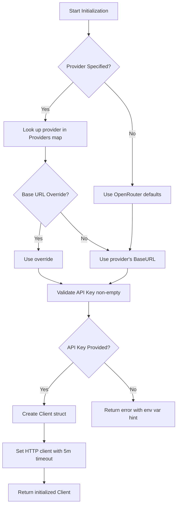

# Client Configuration and Provider Support

This chapter explains how the LLM client in kaioken is configured and initialized for various LLM providers (OpenRouter, OpenAI, Groq, etc.). It covers the provider registry, API key handling, base URL configuration, and the client structure that manages provider-specific endpoints and usage tracking.

## Table of Contents
- [Provider Registry and Configuration](#provider-registry-and-configuration)
- [Client Initialization](#client-initialization)
- [API Key Handling](#api-key-handling)
- [Base URL Configuration](#base-url-configuration)
- [Client Structure](#client-structure)
- [Usage Tracking](#usage-tracking)
- [Environment Variables](#environment-variables)
- [Special Handling for NVIDIA Provider](#special-handling-for-nvidia-provider)

## Provider Registry and Configuration

The `Provider` struct defines the configuration for each LLM provider, specifying the base URL for API endpoints and the environment variable name for the API key.

`internal/llm/openrouter.go:21-24`
```go
type Provider struct {
	BaseURL string
	KeyEnv  string
}
```

The `Providers` map contains pre-configured entries for all supported providers. Each entry maps a provider name to its `Provider` struct with the appropriate base URL and environment variable.

`internal/llm/openrouter.go:28-46`
```go
var Providers = map[string]Provider{
	"openrouter":  {"https://openrouter.ai/api/v1", "OPENROUTER_API_KEY"},
	"openai":      {"https://api.openai.com/v1", "OPENAI_API_KEY"},
	"groq":        {"https://api.groq.com/openai/v1", "GROQ_API_KEY"},
	"together":    {"https://api.together.xyz/v1", "TOGETHER_API_KEY"},
	"deepseek":    {"https://api.deepseek.com/v1", "DEEPSEEK_API_KEY"},
	"mistral":     {"https://api.mistral.ai/v1", "MISTRAL_API_KEY"},
	"ollama":      {"http://localhost:11434/v1", "OLLAMA_API_KEY"},
	"fireworks":   {"https://api.fireworks.ai/inference/v1", "FIREWORKS_API_KEY"},
	"perplexity":  {"https://api.perplexity.ai", "PERPLEXITY_API_KEY"},
	"xai":         {"https://api.x.ai/v1", "XAI_API_KEY"},
	"cerebras":    {"https://api.cerebras.ai/v1", "CEREBRAS_API_KEY"},
	"sambanova":   {"https://api.sambanova.ai/v1", "SAMBANOVA_API_KEY"},
	"huggingface": {"https://api-inference.huggingface.co/v1", "HF_TOKEN"},
	"cohere":      {"https://api.cohere.com/compatibility/v1", "COHERE_API_KEY"},
	"anyscale":    {"https://api.endpoints.anyscale.com/v1", "ANYSCALE_API_KEY"},
	"nvidia":      {"https://integrate.api.nvidia.com/v1", "NVIDIA_API_KEY"},
	"anthropic":   {"https://api.anthropic.com/v1", "ANTHROPIC_API_KEY"},
}
```

## Client Initialization

Clients are created using either `NewForProvider` (for explicit provider selection) or `New` (for OpenRouter-only initialization from environment).

### NewForProvider

`NewForProvider` builds a client for a named provider. It accepts:
- `provName`: Provider name (must match a key in `Providers` or be empty for default)
- `baseURLOverride`: Optional custom base URL (takes precedence over provider default)
- `model`: Model identifier to use
- `apiKey`: API key string (must be non-empty)

If `provName` is found in `Providers`, it uses the provider's base URL (unless overridden) and environment variable name. If not found, it defaults to OpenRouter's configuration. The function validates that an API key is provided.

`internal/llm/openrouter.go:50-70`
```go
func NewForProvider(provName, baseURLOverride, model, apiKey string) (*Client, error) {
	base := baseURLOverride
	keyEnv := "OPENROUTER_API_KEY"
	if p, ok := Providers[provName]; ok {
		if base == "" {
			base = p.BaseURL
		}
		keyEnv = p.KeyEnv
	} else if base == "" {
		base = defaultBaseURL
	}
	if apiKey == "" {
		return nil, fmt.Errorf("no API key — set %s or provide one with /key", keyEnv)
	}
	return &Client{
		APIKey:  apiKey,
		BaseURL: base,
		Model:   model,
		HTTP:    &http.Client{Timeout: 300 * time.Second},
	}, nil
}
```

### New

`New` is a convenience function that creates an OpenRouter client using the `OPENROUTER_API_KEY` environment variable. It returns an error if the variable is unset.

`internal/llm/openrouter.go:125-136`
```go
func New(model string) (*Client, error) {
	key := os.Getenv("OPENROUTER_API_KEY")
	if key == "" {
		return nil, fmt.Errorf("OPENROUTER_API_KEY is not set")
	}
	return &Client{
		APIKey:  key,
		BaseURL: defaultBaseURL,
		Model:   model,
		HTTP:    &http.Client{Timeout: 300 * time.Second},
	}, nil
}
```

## API Key Handling

API keys can be provided directly via function arguments or obtained from environment variables. The `Providers` map specifies which environment variable corresponds to each provider. During initialization:
- `NewForProvider` requires an explicit `apiKey` argument (validated as non-empty)
- `New` reads `OPENROUTER_API_KEY` from the environment
- The client stores the key in its `APIKey` field for use in request headers

## Base URL Configuration

The base URL is determined in this order of precedence:
1. `baseURLOverride` argument to `NewForProvider` (if non-empty)
2. Provider's default `BaseURL` from the `Providers` map (if `provName` is valid)
3. `defaultBaseURL` constant (`https://openrouter.ai/api/v1`) as fallback

The `chatURL()` method constructs the full endpoint path, with special handling for NVIDIA's model-specific invoke URL.

`internal/llm/openrouter.go:247-252`
```go
func (c *Client) chatURL() string {
	if c.nvidiaModelURL {
		return c.BaseURL + "/chat/completions/" + c.Model
	}
	return c.BaseURL + "/chat/completions"
}
```

## Client Structure

The `Client` struct holds all configuration and state for an LLM provider connection.

`internal/llm/openrouter.go:73-96`
```go
type Client struct {
	APIKey  string
	BaseURL string
	Model   string
	HTTP    *http.Client

	// MaxTokens caps the reply length on every request. Zero means "let the
	// provider decide", which is how this used to behave — but OpenRouter
	// reserves credits for the full ceiling up front, so an unset cap makes a
	// large-context model unaffordable on a small balance even when the actual
	// reply would be short. See budget.go.
	MaxTokens int

	usageMu      sync.Mutex
	calls        int
	promptToks   int
	completeToks int

	budgetMu  sync.Mutex
	budgetCap int // ceiling learned from a 402; 0 until the provider tells us

	nvidiaModelURL      bool // currently using the model-specific invoke URL
	nvidiaTriedFallback bool // model-specific URL already attempted; no ping-pong
}
```

Key configuration fields:
- `APIKey`: Authentication token
- `BaseURL`: Provider's API endpoint root
- `Model`: Default model identifier
- `HTTP`: Underlying HTTP client with 5-minute timeout

## Usage Tracking

The client tracks cumulative usage statistics across all requests for monitoring and budgeting purposes. These are reset when a new client is created.

`internal/llm/openrouter.go:100-103`
```go
type usage struct {
	PromptTokens     int `json:"prompt_tokens"`
	CompletionTokens int `json:"completion_tokens"`
}
```

`internal/llm/openrouter.go:105-114`
```go
func (c *Client) recordUsage(u *usage) {
	if u == nil {
		return
	}
	c.usageMu.Lock()
	c.calls++
	c.promptToks += u.PromptTokens
	c.completeToks += u.CompletionTokens
	c.usageMu.Unlock()
}
```

`internal/llm/openrouter.go:118-122`
```go
func (c *Client) Usage() (calls, promptTokens, completionTokens int) {
	c.usageMu.Lock()
	defer c.usageMu.Unlock()
	return c.calls, c.promptToks, c.completeToks
}
```

## Environment Variables

Each provider in the `Providers` map specifies a corresponding environment variable for its API key. The table below shows all provider-specific variables:

| Provider Name | Environment Variable |
|---------------|----------------------|
| openrouter    | OPENROUTER_API_KEY   |
| openai        | OPENAI_API_KEY       |
| groq          | GROQ_API_KEY         |
| together      | TOGETHER_API_KEY     |
| deepseek      | DEEPSEEK_API_KEY     |
| mistral       | MISTRAL_API_KEY      |
| ollama        | OLLAMA_API_KEY       |
| fireworks     | FIREWORKS_API_KEY    |
| perplexity    | PERPLEXITY_API_KEY   |
| xai           | XAI_API_KEY          |
| cerebras      | CEREBRAS_API_KEY     |
| sambanova     | SAMBANOVA_API_KEY    |
| huggingface   | HF_TOKEN             |
| cohere        | COHERE_API_KEY       |
| anyscale      | ANYSCALE_API_KEY     |
| nvidia        | NVIDIA_API_KEY       |
| anthropic     | ANTHROPIC_API_KEY    |

Only `OPENROUTER_API_KEY` is automatically read by the `New` function. Other providers require explicit API key passage via `NewForProvider`.

## Special Handling for NVIDIA Provider

The NVIDIA provider requires special handling due to its two-tier endpoint system:
- Generic router: `/v1/chat/completions` (model in request body)
- Model-specific invoke URL: `/v1/chat/completions/{model}`

When the generic endpoint returns a "Not found for account" error (indicating missing Public API Endpoints permission), the client automatically retries with the model-specific URL. If that URL 404s, it reverts to the generic endpoint to show the actionable error with a hint.

`internal/llm/openrouter.go:263-284`
```go
func (c *Client) nvidia404(err error) bool {
	if err == nil || !strings.Contains(c.BaseURL, "integrate.api.nvidia.com") {
		return false
	}
	msg := err.Error()
	if !strings.Contains(msg, "404") {
		return false
	}
	switch {
	case !c.nvidiaModelURL && strings.Contains(msg, "Not found for account") && !c.nvidiaTriedFallback:
		// Generic router refused — try the model-specific invoke URL once.
		c.nvidiaModelURL = true
		c.nvidiaTriedFallback = true
		return true
	case c.nvidiaModelURL && !strings.Contains(msg, "Not found for account"):
		// The model-specific URL does not exist for this model — revert so
		// the genuine account error (and its hint) is what the user sees.
		c.nvidiaModelURL = false
		return true
	}
	return false
}
```

The hint is appended to persistent NVIDIA 404 errors to guide users toward enabling the required permission.

`internal/llm/openrouter.go:288-293`
```go
const nvidiaAccountHint = "\n→ NVIDIA rejected the model for this account. This usually means the " +
	"'Public API Endpoints' permission is not enabled for your NVIDIA " +
	"organization (common on new Personal accounts). Fix: log in at " +
	"build.nvidia.com → account/org settings → enable Public API Endpoints, " +
	"or generate a fresh API key after enabling. Alternatively, switch " +
	"providers (/provider) to openrouter with the same model name."
```

## Initialization Flow

The following diagram illustrates the client initialization process:



## Referenced Files
- internal/llm/openrouter.go

This chapter covers all provider configuration and client initialization mechanisms as defined in the source code. For details on how the configured client is used to make requests (including streaming, tool use, and error handling), see the parent chapter "LLM Provider Integration".

<!-- kaioken:files internal/llm/openrouter.go -->
