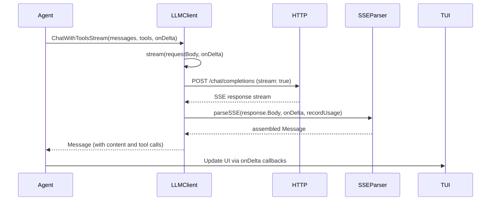
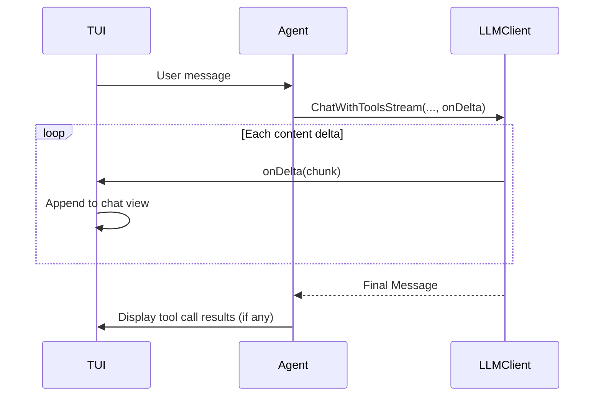

# Streaming Responses

This chapter describes how kaioken handles streaming LLM responses using Server-Sent Events (SSE), including parsing delta events, handling tool call streams, and providing real-time feedback to the user interface. Streaming enables incremental display of LLM output, improving perceived responsiveness during long generations.

## Table of Contents
- [Overview of the Streaming Pipeline](#overview-of-the-streaming-pipeline)
- [Request Preparation](#request-preparation)
- [HTTP Request Execution](#http-request-execution)
- [SSE Stream Parsing](#sse-stream-parsing)
- [Error Handling and Retries](#error-handling-and-retries)
- [Tool Call Streaming](#tool-call-streaming)
- [Integration with Agent and TUI](#integration-with-agent-and-tui)
- [Referenced Files](#referenced-files)

## Overview of the Streaming Pipeline

Kaioken's streaming flow begins when the agent invokes `ChatWithToolsStream` (or `ChatStream` for simple prompts). This function prepares a streaming request to the LLM provider, executes it with automatic retries, and parses the SSE stream into a complete `Message` while invoking a callback for each content delta. The pipeline consists of:

1. **Request building** (`ChatWithToolsStream` → `stream`)
2. **HTTP execution with retries** (`stream` → `doStream`)
3. **SSE parsing and delta handling** (`doStream` → `parseSSE`)
4. **Real-time UI updates** (via `onDelta` callback)



## Request Preparation

The `ChatWithToolsStream` method constructs a `toolChatRequest` with streaming enabled and tool definitions. It sets `Stream: true` and includes `StreamOptions{IncludeUsage: true}` to request final token usage from the provider (which streams don't include by default).

```go
internal/llm/stream.go:68-84
```
```go
reqBody := toolChatRequest{
    Model:         c.Model,
    Messages:      messages,
    Tools:         tools,
    Temperature:   0.3,
    Stream:        true,
    StreamOptions: &streamOptions{IncludeUsage: true},
}
if len(tools) > 0 {
    reqBody.ToolChoice = "auto"
}
body, err := json.Marshal(reqBody)
if err != nil {
    return Message{}, err
}
```

The request body is then passed to `stream`, which applies token ceiling limits and manages retries.

## HTTP Request Execution

The `stream` method handles request execution with exponential backoff retries for 429/5xx errors, but only before any content is emitted to avoid duplicating text. It also handles special cases like 402 (payment required) responses by reducing the token ceiling and retrying immediately.

```go
internal/llm/stream.go:86-124
```
```go
func (c *Client) stream(ctx context.Context, body []byte, onDelta func(string)) (Message, error) {
    ceiling := c.tokenCeiling()
    body = withMaxTokens(body, ceiling)

    backoffs := []time.Duration{0, 3 * time.Second, 10 * time.Second, 25 * time.Second}
    var lastErr error
    shrunk := false
    for i := 0; i < len(backoffs); i++ {
        if backoffs[i] > 0 {
            select {
            case <-time.After(backoffs[i]):
            case <-ctx.Done():
                return Message{}, ctx.Err()
            }
        }
        msg, retryable, err := c.doStream(ctx, body, onDelta)
        if err == nil {
            return msg, nil
        }
        lastErr = err
        // See rawChat: a 402 names the ceiling it would accept, so retry with
        // that instead of backing off. A refused request emitted nothing, so
        // there is no partial stream to duplicate.
        if n, ok := affordableTokens(err); ok && !shrunk {
            shrunk = true
            c.learnCeiling(n)
            ceiling = n
            body = withMaxTokens(body, n)
            i--
            continue
        }
        if !retryable {
            return Message{}, creditError(err, ceiling)
        }
    }
    return Message{}, creditError(fmt.Errorf("giving up after retries: %w", lastErr), ceiling)
}
```

Key behaviors:
- Retries only occur while `!emitted` (tracked in `parseSSE`) to prevent duplicate output
- 402 responses trigger immediate token ceiling reduction without backoff
- Other 4xx/5xx errors use exponential backoff (0s, 3s, 10s, 25s)
- Token ceiling is adjusted downward on 402 errors using provider-suggested limits

## HTTP Request Execution

The `doStream` method performs the actual HTTP request, setting required headers and handling non-200 responses. It distinguishes between retryable errors (5xx, 429) and non-retryable errors (4xx except special cases).

```go
internal/llm/stream.go:126-177
```
```go
func (c *Client) doStream(ctx context.Context, body []byte, onDelta func(string)) (Message, bool, error) {
    req, err := http.NewRequestWithContext(ctx, http.MethodPost,
        c.chatURL(), bytes.NewReader(body))
    if err != nil {
        return Message{}, false, err
    }
    c.setHeaders(req)
    req.Header.Set("Accept", "text/event-stream")

    resp, err := c.HTTP.Do(req)
    if err != nil {
        return Message{}, true, err
    }
    defer resp.Body.Close()

    switch {
    case resp.StatusCode == http.StatusTooManyRequests || resp.StatusCode >= 500:
        raw, _ := io.ReadAll(io.LimitReader(resp.Body, 2000))
        return Message{}, true, fmt.Errorf("provider HTTP %d: %s", resp.StatusCode, truncate(string(raw), 300))
    case resp.StatusCode == http.StatusBadRequest, resp.StatusCode == http.StatusNotFound,
        resp.StatusCode == http.StatusUnprocessableEntity:
        // ... (special handling for NVIDIA 404 and stream unsupported errors)
    case resp.StatusCode != http.StatusOK:
        raw, _ := io.ReadAll(io.LimitReader(resp.Body, 4000))
        return Message{}, false, fmt.Errorf("provider HTTP %d: %s", resp.StatusCode, truncate(string(raw), 400))
    }

    return parseSSE(ctx, resp.Body, onDelta, c.recordUsage)
}
```

Special handling:
- NVIDIA 404 errors trigger a fallback to model-specific URLs before rejecting streaming
- "Not found for account" errors include a hint about organization configuration
- Other 4xx errors are treated as non-retryable stream unsupported errors

## SSE Stream Parsing

The `parseSSE` function consumes the SSE stream, processing each `data:` line. It assembles content deltas and tool call fragments into a complete `Message`, invoking `onDelta` for each content chunk to enable real-time UI updates.

```go
internal/llm/stream.go:179-255
```
```go
func parseSSE(ctx context.Context, r io.Reader, onDelta func(string), record func(*usage)) (Message, bool, error) {
    reader := bufio.NewReaderSize(r, 64*1024)
    var (
        content strings.Builder
        calls   = map[int]*ToolCall{}
        order   []int
        emitted bool
    )

    for {
        if ctx.Err() != nil {
            return Message{}, false, ctx.Err()
        }
        line, readErr := reader.ReadString('\n')

        if payload, ok := strings.CutPrefix(strings.TrimRight(line, "\r\n"), "data:"); ok {
            payload = strings.TrimSpace(payload)
            if payload == "[DONE]" {
                break
            }
            var chunk streamChunk
            if json.Unmarshal([]byte(payload), &chunk) != nil {
                continue // keep-alive or a frame shape we don't model
            }
            if chunk.Error != nil {
                return Message{}, false, fmt.Errorf("provider error: %s", chunk.Error.Message)
            }
            if record != nil {
                record(chunk.Usage)
            }
            for _, ch := range chunk.Choices {
                if ch.Delta.Content != "" {
                    content.WriteString(ch.Delta.Content)
                    if onDelta != nil {
                        onDelta(ch.Delta.Content)
                        emitted = true
                    }
                }
                for _, d := range ch.Delta.ToolCalls {
                    tc, ok := calls[d.Index]
                    if !ok {
                        tc = &ToolCall{Type: "function"}
                        calls[d.Index] = tc
                        order = append(order, d.Index)
                    }
                    if d.ID != "" {
                        tc.ID = d.ID
                    }
                    if d.Type != "" {
                        tc.Type = d.Type
                    }
                    if d.Function.Name != "" {
                        tc.Function.Name = d.Function.Name
                    }
                    tc.Function.Arguments += d.Function.Arguments
                }
            }
        }

        if readErr != nil {
            if readErr == io.EOF {
                break
            }
            return Message{}, !emitted, readErr
        }
    }

    msg := Message{Role: "assistant", Content: content.String()}
    sort.Ints(order)
    for _, idx := range order {
        msg.ToolCalls = append(msg.ToolCalls, *calls[idx])
    }
    return msg, false, nil
}
```

Key mechanisms:
- **Content streaming**: Each `Delta.Content` fragment is appended to a `strings.Builder` and sent to `onDelta`
- **Tool call assembly**: Fragments are grouped by `Index`; `ID`, `Type`, and `Function.Name` are set once; `Arguments` are concatenated
- **Retry safety**: The `emitted` flag tracks whether any content has been delivered; after first emission, network errors become non-retryable
- **Usage tracking**: Final `Usage` object is recorded via the `record` callback when present in `[DONE]` frame
- **Error handling**: Propagates provider errors immediately as non-retryable

## Error Handling and Retries

Streaming errors are classified as retryable only before any content is emitted to the user. The system implements:

1. **Immediate retries** for 402 (payment required) with token ceiling reduction
2. **Exponential backoff** (0s, 3s, 10s, 25s) for 429/5xx errors
3. **Non-retryable treatment** for:
   - 4xx errors (except special NVIDIA cases)
   - Errors after first content emission
   - Provider-reported errors in SSE frames
   - Context cancellation or I/O errors

The `affordableTokens` helper (not shown in stream.go but referenced) extracts suggested token limits from 402 error messages to enable immediate retry with reduced context.

## Tool Call Streaming

Tool calls are assembled incrementally from SSE fragments. Each `toolCallDelta` provides:
- `Index`: Identifies which tool call in the array this fragment belongs to
- `ID`/`Type`: Set once when first received
- `Function.Name`: Set once when first received
- `Function.Arguments`: Accumulated across fragments

```go
internal/llm/stream.go:52-55
```
```go
type toolCallDelta struct {
    Index    int    `json:"index"`
    ID       string `json:"id"`
    Type     string `json:"type"`
    Function struct {
        Name      string `json:"name"`
        Arguments string `json:"arguments"`
    } `json:"function"`
}
```

The parser maintains:
- `calls map[int]*ToolCall`: In-progress tool calls by index
- `order []int`: Sequence of tool call indices for final assembly

When a fragment arrives:
1. If `Index` not seen, create new `ToolCall` and record index
2. Update `ID`, `Type`, `Function.Name` if non-empty
3. Append `Function.Arguments` fragment
4. After stream ends, sort by `order` and append to `Message.ToolCalls`

This handles providers that stream tool calls out-of-order or with fragmented arguments.

## Integration with Agent and TUI

The `onDelta` callback connects streaming to the user interface:
- In `agent/agent.go`, `Run` passes a closure that appends content to the chat display
- The TUI's `composer` updates in real-time as each delta arrives
- Tool calls are not streamed to UI; they're processed after stream completion
- Final `Message` (with assembled content and tool calls) is returned to agent for tool execution



This enables responsive typing indicators and incremental output display without waiting for full generation.

## Referenced Files
- internal/llm/stream.go

<!-- kaioken:files internal/llm/stream.go -->
