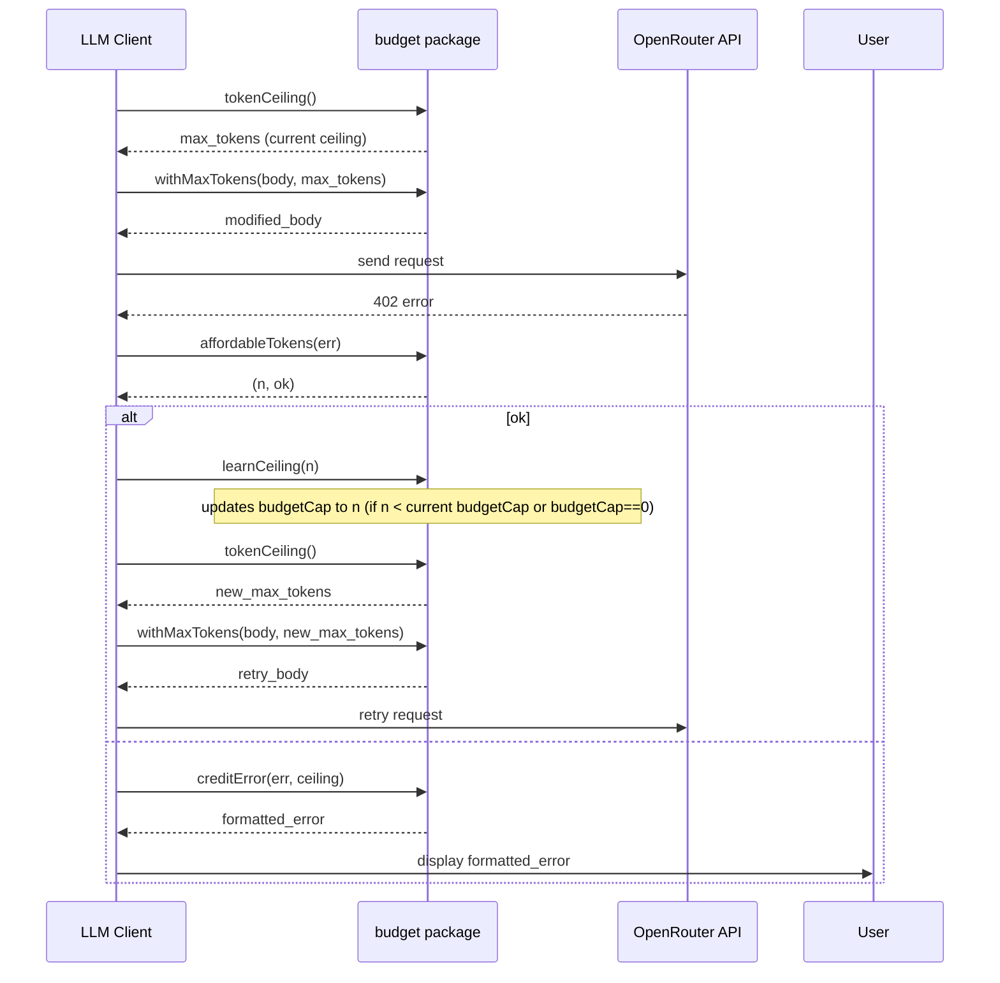

# Token Budget Management

## Introduction
This chapter explains kaioken's dynamic token budgeting mechanism that prevents OpenRouter 402 "payment required" errors by adjusting max_tokens based on model responses. The system learns affordability limits from provider responses, rewrites request bodies to enforce token ceilings, and provides user-friendly error messages when credits are insufficient.

## Table of Contents
- [Introduction](#introduction)
- [Constants](#constants)
- [Token Ceiling Calculation](#token-ceiling-calculation)
- [Learning Affordability Limits](#learning-affordability-limits)
- [Parsing 402 Errors](#parsing-402-errors)
- [Rewriting Request Bodies](#rewriting-request-bodies)
- [User-Friendly Error Messages](#user-friendly-error-messages)
- [Integration with LLM Client](#integration-with-llm-client)
- [Referenced Files](#referenced-files)

## Constants
Two constants define the boundaries for token budgeting:

`internal/llm/budget.go:27-29`
```go
const DefaultMaxTokens = 8192
const minTokenCeiling = 512
```

- `DefaultMaxTokens`: Fallback value (8192 tokens) when no explicit max_tokens is configured. Chosen to be generous for wiki chapters while remaining affordable on modest balances.
- `minTokenCeiling`: Minimum viable token ceiling (512 tokens). Below this value, requests are not sent as they cannot carry useful content and likely indicate zero credits.

## Token Ceiling Calculation
The `tokenCeiling()` method computes the effective max_tokens for each request by considering user configuration and learned affordability limits:

`internal/llm/budget.go:36-48`
```go
func (c *Client) tokenCeiling() int {
	c.budgetMu.Lock()
	defer c.budgetMu.Unlock()

	want := c.MaxTokens
	if want <= 0 {
		want = DefaultMaxTokens
	}
	if c.budgetCap > 0 && c.budgetCap < want {
		return c.budgetCap
	}
	return want
}
```

**Behavior:**
1. Uses configured `MaxTokens` if positive, otherwise defaults to `DefaultMaxTokens`
2. Applies a mutex (`budgetMu`) for thread-safe access to shared state
3. Returns the lesser of the desired tokens (`want`) and the learned budget cap (`c.budgetCap`) when the cap is active and smaller
4. The budget cap (`c.budgetCap`) starts at 0 (unconstrained) and is only updated downward via `learnCeiling()`

## Learning Affordability Limits
When OpenRouter returns a 402 error indicating insufficient credits for the requested token reservation, the `learnCeiling()` method records the provider's stated affordable limit for future requests:

`internal/llm/budget.go:53-59`
```go
func (c *Client) learnCeiling(n int) {
	c.budgetMu.Lock()
	defer c.budgetMu.Unlock()
	if n > 0 && (c.budgetCap == 0 || n < c.budgetCap) {
		c.budgetCap = n
	}
}
```

**Behavior:**
1. Only accepts positive token values (`n > 0`)
2. Updates `budgetCap` to `n` if:
   - No cap has been learned yet (`c.budgetCap == 0`), OR
   - The new value is smaller than the current cap (`n < c.budgetCap`)
3. This creates a downward-ratcheting mechanism: the affordable limit can only decrease during a session, reflecting diminishing credits
4. Mutex protection ensures concurrent requests see consistent state

## Parsing 402 Errors
The `affordableTokens()` function extracts the maximum affordable token count from OpenRouter's 402 error responses:

`internal/llm/budget.go:63`
```go
var affordableRe = regexp.MustCompile(`can only afford (\d+)`)
```

`internal/llm/budget.go:68-90`
```go
func affordableTokens(err error) (int, bool) {
	if err == nil {
		return 0, false
	}
	s := err.Error()
	if !strings.Contains(s, "402") {
		return 0, false
	}
	best := 0
	for _, m := range affordableRe.FindAllStringSubmatch(s, -1) {
		n, convErr := strconv.Atoi(m[1])
		if convErr != nil || n <= 0 {
			continue
		}
		if best == 0 || n < best {
			best = n
		}
	}
	if best < minTokenCeiling {
		return 0, false
	}
	return best, true
}
```

**Behavior:**
1. Returns `(0, false)` for nil errors or non-402 errors
2. Searches error message for all occurrences of "can only afford \<number\>"
3. Selects the smallest positive number from all matches (safe choice when multiple previous attempts are listed)
4. Validates the number is at least `minTokenCeiling` (512) before returning
5. Returns `(0, false)` if no valid affordable value is found

## Rewriting Request Bodies
The `withMaxTokens()` function modifies JSON request bodies to enforce token limits:

`internal/llm/budget.go:96-110`
```go
func withMaxTokens(body []byte, n int) []byte {
	if n <= 0 {
		return body
	}
	var m map[string]json.RawMessage
	if err := json.Unmarshal(body, &m); err != nil {
		return body
	}
	m["max_tokens"] = json.RawMessage(strconv.Itoa(n))
	out, err := json.Marshal(m)
	if err != nil {
		return body
	}
	return out
}
```

**Behavior:**
1. Returns original body if `n <= 0` (no-op for invalid limits)
2. Attempts to parse body as JSON map; returns original on parse failure (resilient to malformed requests)
3. Sets `"max_tokens"` field to string representation of `n`
4. Marshals modified map back to JSON; returns original body on marshal failure
5. Works for both plain and tool-calling request shapes by operating on raw JSON

## User-Friendly Error Messages
The `creditError()` function transforms raw 402 errors into actionable user guidance:

`internal/llm/budget.go:115-128`
```go
func creditError(err error, ceiling int) error {
	if err == nil {
		return nil
	}
	if !strings.Contains(err.Error(), "402") {
		return err
	}
	msg := fmt.Sprintf("out of credits: the account cannot cover a %d-token reply", ceiling)
	if n, ok := affordableTokens(err); ok {
		msg += fmt.Sprintf(" (it can afford about %d)", n)
	}
	return fmt.Errorf("%s — add credits at openrouter.ai/settings/credits, "+
		"or lower max_tokens in .kaioken/config.yaml", msg)
}
```

**Behavior:**
1. Returns nil error for nil input
2. Returns original error for non-402 errors
3. Constructs base message showing current token ceiling that caused the failure
4. Appends affordable token estimate (if detectable) from error parsing
5. Provides specific remediation steps: add credits via OpenRouter dashboard or reduce max_tokens in config
6. Wraps message in `fmt.Errorf` for consistent error handling

## Integration with LLM Client
The budgeting functions work together within the LLM client's request lifecycle:

1. **Request Preparation**  
   Before sending a request, the client calls `tokenCeiling()` to determine the appropriate max_tokens value, then uses `withMaxTokens()` to inject this limit into the JSON request body.

2. **402 Error Handling**  
   On receiving a 402 error:
   - Client invokes `affordableTokens(err)` to extract a new affordable limit
   - If valid, calls `learnCeiling(n)` to update the session's budget cap (downward ratchet)
   - Recalculates token ceiling via `tokenCeiling()` (now respecting the new cap)
   - Rewrites request body with `withMaxTokens()` using the updated limit
   - Retries the request with the modified body

3. **Error Reporting**  
   If recovery fails (no affordable limit found or credits exhausted), the client uses `creditError()` to generate a user-facing message that includes:
   - Current token ceiling that caused the failure
   - Estimated affordable tokens (if detectable)
   - Specific remediation instructions

**Sequence Diagram**  
The following diagram illustrates the budgeting package's role during a 402 error recovery sequence:



**Key Properties:**
- Thread safety: All budget state accesses are protected by `c.budgetMu`
- Monotonic reduction: `budgetCap` only decreases during a session via `learnCeiling()`
- Fail-open behavior: JSON parsing failures in `withMaxTokens()` preserve original request
- Conservative parsing: `affordableTokens()` selects the smallest valid number from error matches
- User guidance: `creditError()` provides concrete remediation steps

## Referenced Files
- internal/llm/budget.go

<!-- kaioken:files internal/llm/budget.go -->
