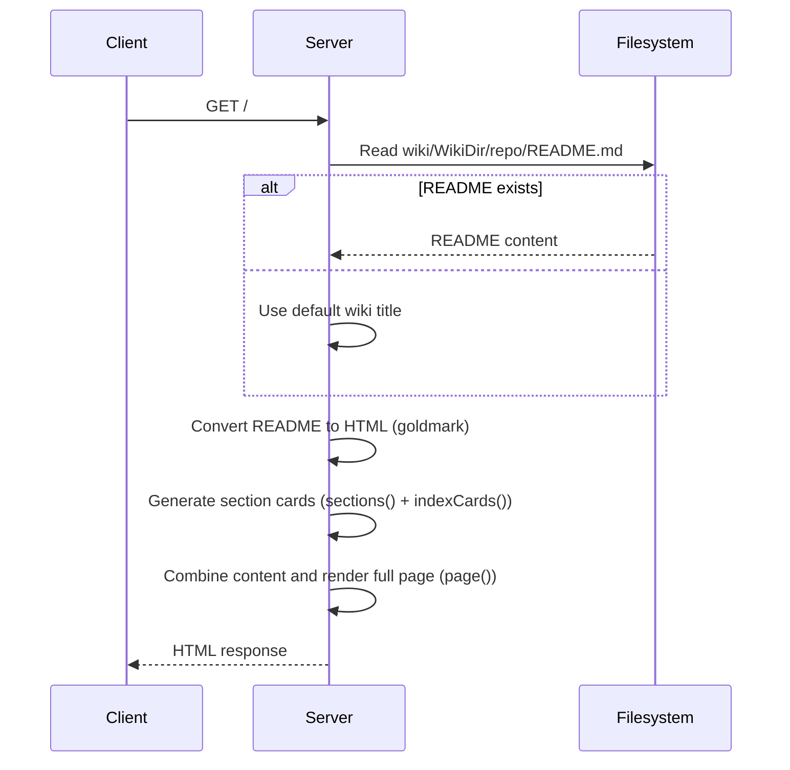
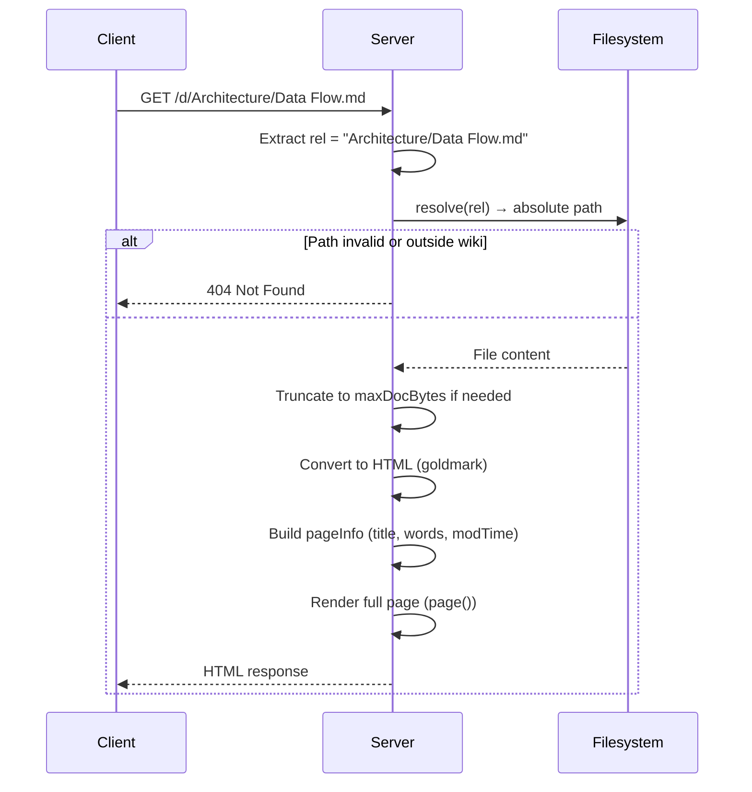
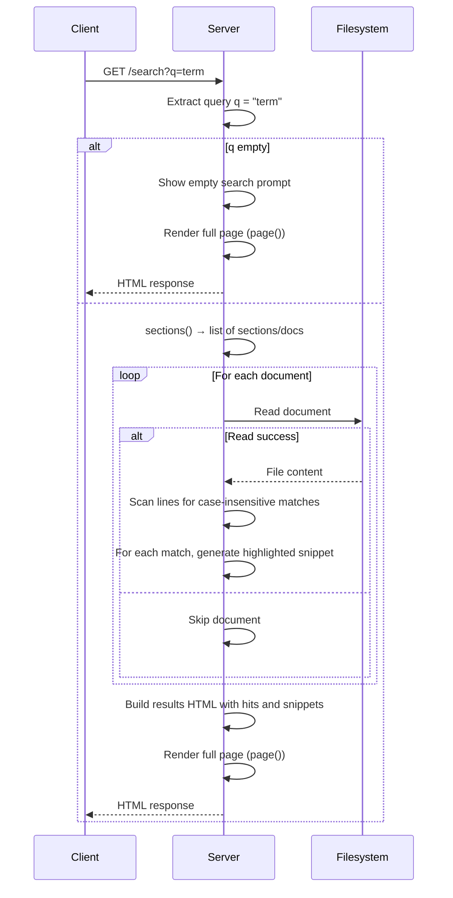
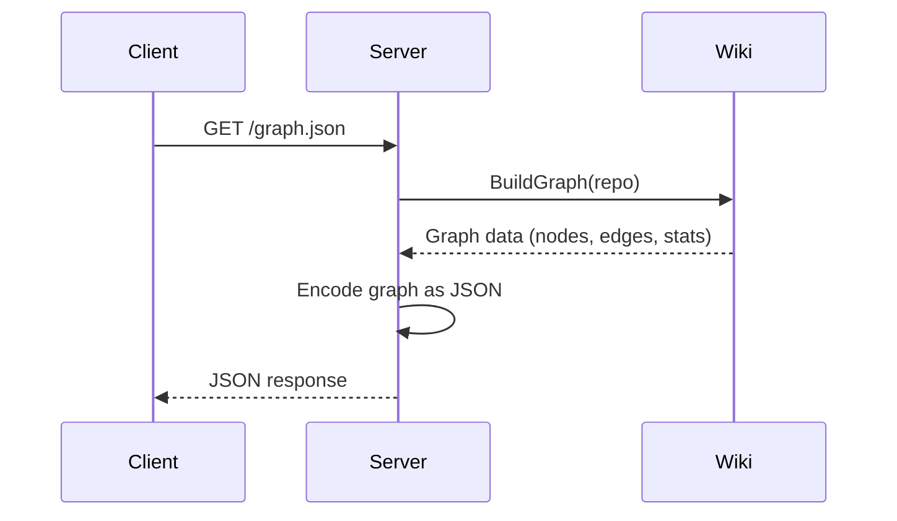
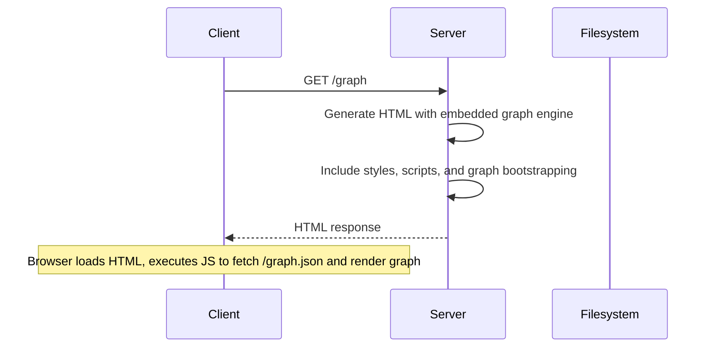

# Server Routing and Request Handling

This chapter describes how the Kaioken wiki server serves generated documentation via HTTP endpoints. It covers the routes (`/`, `/d/`, `/search`, `/graph`, and `/graph.json`), their request processing flows, and the supporting functions that render content, build navigation, and handle search.

## Table of Contents
- [Architecture Overview](#architecture-overview)
- [Index Endpoint (`/`)](#index-endpoint-)
- [Documentation Endpoint (`/d/`)](#documentation-endpoint-d)
- [Search Endpoint (`/search`)](#search-endpoint-search)
- [Graph Endpoints (`/graph` and `/graph.json`)](#graph-endpoints-graph-and-graphjson)
- [Supporting Functions](#supporting-functions)
- [Request Flow Diagrams](#request-flow-diagrams)
- [Referenced Files](#referenced-files)

## Architecture Overview

The wiki server is implemented in `internal/serve/serve.go`. It uses the `goldmark` Markdown renderer to convert `.md` files to HTML and serves them within a consistent HTML template that includes a sidebar navigation, breadcrumbs, and search functionality.

The `Server` struct holds the repository path, a pre-configured Markdown renderer, and a `static` flag for export mode:

```go
// Server renders a repository's wiki over HTTP.
type Server struct {
	repo string
	md   goldmark.Markdown
	// static switches the link scheme from server routes (/d/<rel>) to flat
	// relative .html slugs, and drops the server-only chrome (search, graph).
	// Set only by the static export path.
	static bool
}
```

The `New` function initializes the server with GitHub Flavored Markdown support:

`internal/serve/serve.go:89-97`
```go
// New builds a server for a repository.
func New(repo string) *Server {
	return &Server{
		repo: repo,
		md: goldmark.New(
			goldmark.WithExtensions(extension.GFM), // tables, strikethrough, autolinks
			goldmark.WithRendererOptions(mdhtml.WithUnsafe()),
		),
	}
}
```

The `Run` function starts the HTTP server, binding to the provided address and invoking the `ready` callback with the bound URL:

`internal/serve/serve.go:102-127`
```go
// Run serves the wiki until ctx is cancelled. It returns the address actually
// bound, via the ready callback, so a caller can print a working URL even when
// port 0 was requested.
func Run(ctx context.Context, repo, addr string, ready func(url string)) error {
	if _, err := os.Stat(wiki.WikiDir(repo)); err != nil {
		return fmt.Errorf("no generated wiki at %s — run the wiki first", wiki.WikiDir(repo))
	}
	ln, err := net.Listen("tcp", addr)
	if err != nil {
		return err
	}
	srv := &http.Server{
		Handler:           New(repo).routes(),
		ReadHeaderTimeout: 10 * time.Second,
	}
	if ready != nil {
		ready("http://" + ln.Addr().String())
	}
	go func() {
		<-ctx.Done()
		shutdownCtx, cancel := context.WithTimeout(context.Background(), 3*time.Second)
		defer cancel()
		_ = srv.Shutdown(shutdownCtx)
	}()
	if err := srv.Serve(ln); err != nil && !errors.Is(err, http.ErrServerClosed) {
		return err
	}
	return nil
}
```

The `routes` method registers five handlers:

`internal/serve/serve.go:129-137`
```go
func (s *Server) routes() http.Handler {
	mux := http.NewServeMux()
	mux.HandleFunc("/", s.handleIndex)
	mux.HandleFunc("/d/", s.handleDoc)
	mux.HandleFunc("/search", s.handleSearch)
	mux.HandleFunc("/graph", s.handleGraphPage)
	mux.HandleFunc("/graph.json", s.handleGraphJSON)
	return mux
}
```

## Index Endpoint (`/`)

The root endpoint (`/`) serves the wiki overview page. It optionally displays a `README.md` file from the wiki root and renders a grid of section cards linking to each documentation chapter.

### Request Handling

`handleIndex` checks for an exact path match to `/`, then attempts to read `README.md`:

`internal/serve/serve.go:209-218`
```go
func (s *Server) handleIndex(w http.ResponseWriter, r *http.Request) {
	if r.URL.Path != "/" {
		http.NotFound(w, r)
		return
	}
	w.Header().Set("Content-Type", "text/html; charset=utf-8")
	if err := s.renderIndex(w); err != nil {
		http.Error(w, "render error: "+err.Error(), http.StatusInternalServerError)
	}
}
```

If `README.md` exists, its content is converted to HTML and combined with the output of `indexCards()` (which generates the section grid). The combined HTML is passed to the `page` function for full template rendering.

### Section Card Generation

`indexCards` builds the navigation grid by iterating over sections returned from `sections()`:

`internal/serve/serve.go:241-265`
```go
// indexCards renders the chapter overview grid shown below the README.
func (s *Server) indexCards() string {
	secs := s.sections()
	if len(secs) == 0 {
		return ""
	}
	var b strings.Builder
	b.WriteString(`<div class="cards">`)
	for _, sec := range secs {
		fmt.Fprintf(&b, `<a class="card" href="%s"><div class="card-name">%s</div>`,
			htmlEscape(s.docHref(sec.Docs[0].Rel)), htmlEscape(sec.Name))
		fmt.Fprintf(&b, `<div class="card-count">%d docs</div><ul>`, len(sec.Docs))
		for i, d := range sec.Docs {
			if i >= 3 {
				break
			}
			fmt.Fprintf(&b, `<li>%s</li>`, htmlEscape(d.Title))
		}
		if len(sec.Docs) > 3 {
			fmt.Fprintf(&b, `<li class="more">+ %d more…</li>`, len(sec.Docs)-3)
		}
		b.WriteString(`</ul></a>`)
	}
	b.WriteString(`</div>`)
	return b.String()
}
```

For each section, it links to the first document (typically the section's main document) and lists up to three document titles, with a "more" indicator if there are additional documents.

## Documentation Endpoint (`/d/`)

The `/d/` endpoint serves individual documentation pages. It expects a wiki-relative path (e.g., `Architecture/Data Flow.md`) and renders the corresponding Markdown file as HTML within the full page template.

### Request Handling

`handleDoc` extracts the path prefix, resolves it to an absolute filesystem path, reads and truncates the file (to `maxDocBytes`), converts it to HTML, and builds a `pageInfo`:

`internal/serve/serve.go:267-273`
```go
func (s *Server) handleDoc(w http.ResponseWriter, r *http.Request) {
	rel := strings.TrimPrefix(r.URL.Path, "/d/")
	w.Header().Set("Content-Type", "text/html; charset=utf-8")
	if err := s.renderDoc(w, rel); err != nil {
		http.Error(w, "not found", http.StatusNotFound)
	}
}
```

The `resolve` function ensures the requested path stays within the wiki directory:

`internal/serve/serve.go:184-197`
```go
// resolve maps a wiki-relative path to an absolute one, refusing escapes.
func (s *Server) resolve(rel string) (string, error) {
	root, err := filepath.Abs(wiki.WikiDir(s.repo))
	if err != nil {
		return "", err
	}
	abs, err := filepath.Abs(filepath.Join(root, filepath.FromSlash(rel)))
	if err != nil {
		return "", err
	}
	if abs != root && !strings.HasPrefix(abs, root+string(os.PathSeparator)) {
		return "", fmt.Errorf("path outside the wiki")
	}
	return abs, nil
}
```

### Supporting Render Functions

`renderIndex` and `renderDoc` are shared between the HTTP server and static export:

`internal/serve/serve.go:223-238`
```go
// renderIndex writes the overview page — the wiki README (or a placeholder)
// plus the chapter cards. Shared verbatim by the HTTP server and the static
// export, so the two cannot drift apart.
func (s *Server) renderIndex(w io.Writer) error {
	body := "# Repository Wiki\n\nPick a chapter from the sidebar.\n"
	if raw, err := os.ReadFile(filepath.Join(wiki.WikiDir(s.repo), "README.md")); err == nil {
		body = string(raw)
	}
	var content bytes.Buffer
	if err := s.md.Convert([]byte(body), &content); err != nil {
		return err
	}
	s.page(w, pageInfo{
		title:    "Wiki",
		bodyHTML: content.String() + s.indexCards(),
		isIndex:  true,
	})
	return nil
}
```

`internal/serve/serve.go:277-305`
```go
// renderDoc writes one document page. Errors cover both a missing file and a
// path outside the wiki; the HTTP layer answers both with 404.
func (s *Server) renderDoc(w io.Writer, rel string) error {
	abs, err := s.resolve(rel)
	if err != nil {
		return err
	}
	raw, err := os.ReadFile(abs)
	if err != nil {
		return err
	}
	if len(raw) > maxDocBytes {
		raw = raw[:maxDocBytes]
	}
	var content bytes.Buffer
	if err := s.md.Convert(raw, &content); err != nil {
		return err
	}
	title := strings.TrimSuffix(filepath.Base(rel), ".md")
	info := pageInfo{
		title:    title,
		current:  rel,
		bodyHTML: content.String(),
		words:    len(strings.Fields(string(raw))),
	}
	if fi, err := os.Stat(abs); err == nil {
		info.modTime = fi.ModTime()
	}
	s.page(w, info)
	return nil
}
```

## Search Endpoint (`/search`)

The `/search` endpoint handles full-text search across all documentation files. It accepts a query parameter `q` and returns matching documents with highlighted snippets.

### Request Handling

`handleSearch` processes the query, searches each document line-by-line for case-insensitive matches, and builds a results page:

`internal/serve/serve.go:307-358`
```go
func (s *Server) handleSearch(w http.ResponseWriter, r *http.Request) {
	w.Header().Set("Content-Type", "text/html; charset=utf-8")
	q := strings.TrimSpace(r.URL.Query().Get("q"))
	if q == "" {
		s.page(w, pageInfo{
			title:    "Search",
			bodyHTML: "<h1>Search</h1><p>Enter a term above.</p>",
		})
		return
	}
	var b strings.Builder
	fmt.Fprintf(&b, `<h1>Search: %s</h1>`, htmlEscape(q))
	needle := strings.ToLower(q)
	hits, total := 0, 0
	for _, sec := range s.sections() {
		for _, doc := range sec.Docs {
			abs, err := s.resolve(doc.Rel)
			if err != nil {
				continue
			}
			raw, err := os.ReadFile(abs)
			if err != nil {
				continue
			}
			var matches []string
			for i, line := range strings.Split(string(raw), "\n") {
				if strings.Contains(strings.ToLower(line), needle) {
					matches = append(matches, fmt.Sprintf(
						`<div class="hit"><span class="hit-line">line %d</span> %s</div>`,
						i+1, highlightHTML(line, q)))
					if len(matches) >= 5 {
						break
					}
				}
			}
			if len(matches) == 0 {
				continue
			}
			hits++
			total += len(matches)
			fmt.Fprintf(&b, `<div class="result"><a class="result-title" href="/d/%s">%s <span class="result-sec">/ %s</span></a><div class="result-matches">%s</div></div>`,
				htmlEscape(doc.Rel), htmlEscape(doc.Title), htmlEscape(sec.Name),
				strings.Join(matches, ""))
		}
	}
	if hits == 0 {
		b.WriteString(`<p class="no-hits">No matches.</p>`)
	} else {
		fmt.Fprintf(&b, `<p class="hit-summary">%d match(es) across %d document(s)</p>`, total, hits)
	}
	s.page(w, pageInfo{title: "Search", bodyHTML: b.String()})
}
```

For each matching line, `highlightHTML` wraps the search term in `<mark>` tags after escaping HTML:

`internal/serve/serve.go:400-421`
```go
// highlightHTML escapes a line and wraps case-insensitive needle matches in
// <mark> tags for the search results page.
func highlightHTML(line, needle string) string {
	if needle == "" {
		return htmlEscape(line)
	}
	lower, n := strings.ToLower(line), strings.ToLower(needle)
	var b strings.Builder
	start := 0
	for {
		i := strings.Index(lower[start:], n)
		if i < 0 {
			b.WriteString(htmlEscape(line[start:]))
			break
		}
		i += start
		b.WriteString(htmlEscape(line[start:i]))
		b.WriteString("<mark>")
		b.WriteString(htmlEscape(line[i : i+len(n)]))
		b.WriteString("</mark>")
		start = i + len(n)
	}
	return b.String()
}
```

## Graph Endpoints (`/graph` and `/graph.json`)

The `/graph.json` endpoint serves the wiki's dependency graph as JSON, used by the `/graph` endpoint to render an interactive visualization.

### JSON Endpoint Handling

`handleGraphJSON` serves the same payload as the daemon's `/v1/workspaces/{id}/wiki/graph` endpoint:

`internal/serve/serve.go:363-371`
```go
// handleGraphJSON serves the same wiki.BuildGraph payload the daemon does at
// /v1/workspaces/{id}/wiki/graph — the same encoder on the same struct, so
// the two transports are byte-identical for the same repository.
func (s *Server) handleGraphJSON(w http.ResponseWriter, r *http.Request) {
	g, err := wiki.BuildGraph(s.repo)
	if err != nil {
		http.Error(w, "graph error: "+err.Error(), http.StatusInternalServerError)
		return
	}
	w.Header().Set("Content-Type", "application/json; charset=utf-8")
	_ = json.NewEncoder(w).Encode(g)
}
```

### Graph Page Handling

`handleGraphPage` renders an interactive graph view using an embedded engine:

`internal/serve/serve.go:376-396`
```go
// handleGraphPage renders the full-bleed graph view: a canvas driven by the
// embedded engine, plus a small control strip. Clicking a doc node navigates
// to /d/<rel>; file nodes are inert — there is no editor to open into.
func (s *Server) handleGraphPage(w http.ResponseWriter, r *http.Request) {
	w.Header().Set("Content-Type", "text/html; charset=utf-8")
	_, _ = w.Write([]byte(`<!doctype html><html lang="en"><head>
<meta charset="utf-8"><meta name="viewport" content="width=device-width,initial-scale=1">
<title>Graph · Kaioken Wiki</title><link rel="icon" href="` + favicon + `"><style>` +
		styles + graphStyles + `</style></head><body class="graph-page">
<a class="graph-back" href="/">← wiki</a>
<div class="graph-bar">
<label><input type="checkbox" id="f-files" checked> files</label>
<label><input type="checkbox" id="f-contains" checked> contains</label>
<label><input type="checkbox" id="f-links" checked> links</label>
<label><input type="checkbox" id="f-source" checked> source</label>
<button type="button" id="g-fit">fit</button>
<span id="g-stats"></span>
</div>
<div class="graph-main"><canvas id="graph-canvas"></canvas>
<div id="g-empty">no wiki generated yet — run the wiki first</div></div>
<script>` + graphJS + `</script>
<script>` + graphBoot + `</script>
</body></html>`))
```

## Supporting Functions

Several functions support the handlers by providing navigation, page rendering, and utility features.

### Section Tree Construction

`sections` walks the wiki directory to build a hierarchical navigation structure:

`internal/serve/serve.go:140-181`
```go
// sections walks the wiki directory into a nav tree.
func (s *Server) sections() []Section {
	root := wiki.WikiDir(s.repo)
	entries, err := os.ReadDir(root)
	if err != nil {
		return nil
	}
	var out []Section
	for _, e := range entries {
		if !e.IsDir() {
			continue
		}
		docs, err := os.ReadDir(filepath.Join(root, e.Name()))
		if err != nil {
			continue
		}
		sec := Section{Name: e.Name()}
		for _, d := range docs {
			if d.IsDir() || !strings.HasSuffix(d.Name(), ".md") {
				continue
			}
			sec.Docs = append(sec.Docs, Doc{
				Title: strings.TrimSuffix(d.Name(), ".md"),
				Rel:   e.Name() + "/" + d.Name(),
			})
		}
		if len(sec.Docs) == 0 {
			continue
		}
		// The chapter's own document leads; the rest follow alphabetically.
		sort.Slice(sec.Docs, func(i, j int) bool {
			if sec.Docs[i].Title == sec.Name {
				return true
			}
			if sec.Docs[j].Title == sec.Name {
				return false
			}
			return sec.Docs[i].Title < sec.Docs[j].Title
		})
		out = append(out, sec)
	}
	return out
}
```

Each section's documents are sorted so that the document matching the section name appears first, followed by alphabetical ordering.

### Page Rendering

`page` assembles the full HTML response, including sidebar navigation, breadcrumbs, metadata, previous/next navigation, and table of contents:

`internal/serve/serve.go:426-539`
```go
// page renders fully-built article HTML inside the site chrome: sidebar tree,
// breadcrumbs, meta line, prev/next pager, and the table-of-contents rail.
// It writes plain HTML — callers own the transport headers.
func (s *Server) page(w io.Writer, info pageInfo) {
	// ... (omitted for brevity; see source for full implementation)
}
```

Key steps include:
1. Extracting the first `<h1>` for breadcrumb placement.
2. Generating heading anchors and table of contents via `injectHeadingIDs`.
3. Building breadcrumbs and metadata (read time, last updated).
4. Computing previous/next document links via `neighbors`.
5. Rendering the sidebar tree with section groups and documents.
6. Injecting CSS and JavaScript constants (`styles`, `scripts`, `mermaidBootstrap`, `favicon`).
7. Conditioning the search form and graph link on the `static` flag.

### Navigation Helpers

`neighbors` computes the previous and next documents in reading order:

`internal/serve/serve.go:549-566`
```go
// neighbors returns the docs before and after rel in reading order.
func neighbors(secs []Section, rel string) (prev, next *Doc) {
	var flat []Doc
	for _, sec := range secs {
		flat = append(flat, sec.Docs...)
	}
	for i := range flat {
		if flat[i].Rel == rel {
			if i > 0 {
				prev = &flat[i-1]
			}
			if i+1 < len(flat) {
				next = &flat[i+1]
			}
			return
		}
	}
	return
}
```

`humanDate` formats timestamps for the metadata line:

`internal/serve/serve.go:568-580`
```go
func humanDate(t time.Time) string {
	d := time.Since(t)
	switch {
	case d < time.Hour:
		return "just now"
	case d < 24*time.Hour:
		return fmt.Sprintf("%dh ago", int(d.Hours()))
	case d < 7*24*time.Hour:
		return fmt.Sprintf("%dd ago", int(d.Hours()/24))
	default:
		return t.Format("Jan 2, 2006")
	}
}
```

### HTML Utilities

`injectHeadingIDs` adds stable IDs to `<h2>` and `<h3>` elements for table of contents linking:

`internal/serve/serve.go:595-625`
```go
// injectHeadingIDs adds stable id attributes to h2/h3 elements and returns the
// rewritten HTML plus a table of contents built from them.
func injectHeadingIDs(htmlBody string) (string, []tocEntry) {
	var toc []tocEntry
	seen := map[string]int{}
	out := headingRe.ReplaceAllStringFunc(htmlBody, func(m string) string {
		sub := headingRe.FindStringSubmatch(m)
		level := 2
		if sub[1] == "3" {
			level = 3
		}
		attrs := sub[2]
		inner := sub[3]
		if strings.Contains(attrs, "id=") {
			return m // already anchored
		}
		text := strings.TrimSpace(tagRe.ReplaceAllString(inner, ""))
		base := slugify(text)
		if base == "" {
			return m
		}
		// Deduplicate: the count is keyed on the base slug so a third identical
		// heading becomes "-2", not a collision with "-1".
		id := base
		if n := seen[base]; n > 0 {
			id = fmt.Sprintf("%s-%d", base, n)
		}
		seen[base]++
		toc = append(toc, tocEntry{id: id, text: text, level: level})
		return fmt.Sprintf(`<h%d%s id="%s">%s</h%d>`, level, attrs, id, inner, level)
	})
	return out, toc
}
```

`slugify` converts heading text to URL-safe anchor IDs:

`internal/serve/serve.go:628-645`
```go
// slugify turns heading text into a URL-safe anchor id.
func slugify(s string) string {
	s = strings.ToLower(strings.TrimSpace(s))
	var b strings.Builder
	lastDash := false
	for _, r := range s {
		switch {
		case r >= 'a' && r <= 'z' || r >= '0' && r <= '9':
			b.WriteRune(r)
			lastDash = false
		case r == ' ' || r == '-' || r == '_' || r == '.':
			if !lastDash && b.Len() > 0 {
				b.WriteRune('-')
				lastDash = true
			}
		}
	}
	return strings.Trim(b.String(), "-")
}
```

## Request Flow Diagrams

### Index Request Flow


### Document Request Flow


### Search Request Flow


### Graph JSON Request Flow


### Graph Page Request Flow


## Referenced Files
- `internal/serve/serve.go` (primary implementation)

<!-- kaioken:files internal/serve/serve.go -->
