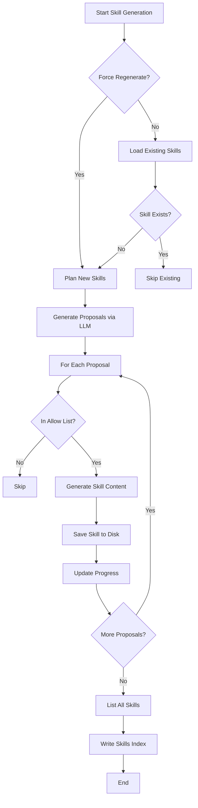
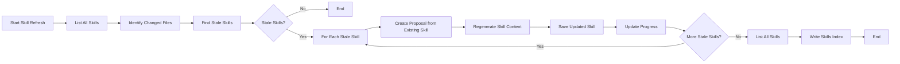

# Skill Generation

## Table of Contents
- [Overview](#overview)
- [Skill Structure](#skill-structure)
- [Skill Generation Process](#skill-generation-process)
  - [Planning Skills](#planning-skills)
  - [Writing Skill Content](#writing-skill-content)
- [Skill Refresh Process](#skill-refresh-process)
- [Skill Storage and Indexing](#skill-storage-and-indexing)
- [Error Handling and Concurrency](#error-handling-and-concurrency)
- [Referenced Files](#referenced-files)

## Overview

Kaioken's skill generation system creates task-oriented guides (skills) that teach AI agents how to perform specific recurring tasks in a repository. Unlike the wiki which documents *what* the codebase contains, skills focus on *how* to accomplish tasks—detailing which files to modify, in what order, and following local conventions.

The process involves two main phases:
1. **Planning**: Using an LLM to analyze the repository and propose relevant skill topics based on actual project patterns
2. **Writing**: Generating detailed skill content for each proposal using repository context from code maps and wiki

Skills are stored as `SKILL.md` files in `.kaioken/skills/<name>/` with YAML frontmatter containing metadata and a markdown body. The system supports both initial generation and incremental refresh when source files change.

## Skill Structure

Each skill follows the Agent Skills format with YAML frontmatter and a markdown body:

```yaml
name: add-a-tui-command
description: "Add a new command to the TUI's command palette. Load this skill when implementing new slash-commands like /test or /deploy."
sources:
- internal/tui/tui.go
- internal/tui/command.go
generated_at: 2024-01-15T10:30:00Z
model: openrouter/anthropic/claude-3-opus
origin: generated
use_count: 0
last_used: 0001-01-01T00:00:00Z
sessions: []
```

```markdown
# Add a TUI Command

One or two sentences: what this skill covers and when to use it.

## Prerequisites
Only if there are real ones (a running service, a generated file, an env var).

## Steps
A numbered list. Each step names REAL files and functions from the sources, in the order a contributor touches them. Where a step means "copy the existing pattern", show the pattern with a short verbatim excerpt and its path.

## Conventions to follow
The local rules that are NOT obvious from the code alone: naming, error handling, where registration happens, what must be updated in lockstep. Be specific to this repo.

## Verification
How to confirm the change worked here — the actual test/build/run command used in this repo.

## Common mistakes
Failure modes a newcomer or an agent hits in THIS codebase. Only real ones you can support from the sources (a registry that must be updated, a test that must be regenerated).
```

The `Skill` struct in `internal/skills/skills.go` defines this structure:

```
`internal/skills/skills.go:29-60`
```

```go
type Skill struct {
	// Name is a kebab-case identifier, also the directory name.
	Name string `yaml:"name"`
	// Description says what the skill covers and when to load it. Agent
	// runtimes match against this, so it carries the triggering weight.
	Description string `yaml:"description"`
	// Sources are the repo-relative files this skill was written from. They
	// drive incremental refresh: when one changes, the skill is stale.
	Sources     []string  `yaml:"sources,omitempty"`
	GeneratedAt time.Time `yaml:"generated_at,omitempty"`
	Model       string    `yaml:"model,omitempty"`

	// Origin records how this skill came to exist. A generated skill is
	// written from static analysis of the repo by skills.Run; a learned one is
	// distilled from a session that actually did the task; a human one was
	// dropped in by hand. The distinction is what lets a reviewer tell a
	// hard-won lesson from a guess.
	Origin string `yaml:"origin,omitempty"`
	// UseCount is how many sessions opened this skill and followed it to a
	// clean outcome. It is the reinforcement signal: a loaded skill that
	// worked is more likely to be the right answer next time.
	UseCount int `yaml:"use_count,omitempty"`
	// LastUsed is the most recent session that consulted this skill, so a
	// skill nobody has reached for in a long time can be flagged for pruning.
	LastUsed time.Time `yaml:"last_used,omitempty"`
	// Sessions records the ids of sessions that contributed to or reinforced
	// this skill, so a learned skill carries its provenance and can be
	// reverted to the generated baseline when a lesson turns out wrong.
	Sessions []string `yaml:"sessions,omitempty"`

	// Body is the markdown after the frontmatter.
	Body string `yaml:"-"`
}
```

Key fields:
- `Name`: Kebab-case identifier used as directory name (e.g., `add-a-tui-command`)
- `Description`: Human-readable explanation used by agent runtimes to determine skill relevance
- `Sources`: List of repo-relative files used to generate the skill; drives stale detection
- `GeneratedAt`: Timestamp when skill was created
- `Model`: LLM model used for generation
- `Origin`: How the skill originated (`generated`, `learned`, or `human`)
- `UseCount`: Number of times the skill was successfully used in a session
- `LastUsed`: Timestamp of most recent skill usage
- `Sessions`: List of session IDs that contributed to or used the skill
- `Body`: Markdown content after YAML frontmatter

## Skill Generation Process

Skill generation occurs in two distinct phases: planning (identifying what skills to create) and writing (generating content for each skill).

### Planning Skills

The planning phase uses an LLM to analyze the repository and propose relevant skill topics. This happens in `internal/skills/generate.go` via the `plan` function:

```
`internal/skills/generate.go:258-310`
```

```go
func plan(ctx context.Context, repo string, cfg *config.Config, client *llm.Client,
	res *scan.Result, idx *codemap.Index) ([]proposal, error) {
```

The planning process:
1. **Gather repository context**:
   - File tree summary (`res.TreeSummary(10)`)
   - Manifest contents (package.json, Cargo.toml, etc.) (`res.ManifestContents(4000)`)
   - Code structure skeleton (`idx.RepoSkeleton(8000)`)
   - Existing architecture brief (if present)
   - Existing wiki chapter names (to avoid duplication)
   - Maintainer steering notes from config

2. **Construct LLM prompt** with the gathered context and the `planSystem` constant:
   ```
   `internal/skills/generate.go:58-81`
   ```

   ```go
   const planSystem = `You are deciding which SKILLS to write for a specific repository.

   A skill is a short, task-oriented guide an AI coding agent loads at the moment it starts
   work: "how do I do X in THIS project". Good skills describe RECURRING TASKS a contributor
   actually performs — not descriptions of what the code is, which the wiki already covers.

   Good skills for a typical repo look like:
   - add-an-api-endpoint, add-a-cli-command, add-a-database-migration
   - write-a-test, run-the-test-suite, debug-a-failing-build
   - add-a-ui-component, wire-a-new-config-option, release-a-version

   Bad skills (do NOT produce these):
   - "architecture-overview", "project-structure" — those are wiki chapters, not tasks
   - anything a general model already knows without this repo ("how to write Go")

   Propose 5-12 skills that fit THIS repository's actual stack and layout. For each give:
   - name: kebab-case, verb-led, specific ("add-a-tui-command", not "tui")
   - description: one or two sentences saying what it covers AND when an agent should load it.
     This is what a runtime matches against, so name the concrete triggers.
   - task: one sentence stating the task the skill teaches
   - files: the repo-relative files or directories that show how this task is done here —
     include real examples an agent should imitate

   Return ONLY JSON: {"skills":[{"name":"...","description":"...","task":"...","files":["..."]}]}`
   ```

3. **Process LLM response**:
   - Parse JSON into `[]proposal`
   - Normalize names via `Slug` function (kebab-case, trim special chars)
   - Deduplicate proposals
   - Return planned skills

The `proposal` struct defines the planning output:

```
`internal/skills/generate.go:51-56`
```

```go
type proposal struct {
	Name        string   `json:"name"`
	Description string   `json:"description"`
	Task        string   `json:"task"`
	Files       []string `json:"files"`
}
```

### Writing Skill Content

For each approved proposal, the `write` function generates the skill's markdown body:

```
`internal/skills/generate.go:313-363`
```

```go
func write(ctx context.Context, repo string, cfg *config.Config, client *llm.Client,
	res *scan.Result, idx *codemap.Index, p proposal) (*Skill, error) {
```

The writing process:
1. **Resolve source files**: Convert proposal's file/directory list to actual scanned files using `resolve`:
   ```
   `internal/skills/generate.go:366-384`
   ```

   ```go
   func resolve(res *scan.Result, scope []string) []scan.File {
   	seen := map[string]bool{}
   	var out []scan.File
   	for _, s := range scope {
   		s = strings.Trim(filepath.ToSlash(strings.TrimSpace(s)), "/")
   		if s == "" {
   			continue
   		}
   		for _, f := range res.Files {
   			if f.Path == s || strings.HasPrefix(f.Path, s+"/") {
   				if !seen[f.Path] {
   					seen[f.Path] = true
   					out = append(out, f)
   				}
   			}
   		}
   	}
   	return out
   }
   ```

2. **Build LLM context**:
   - Skill metadata (name, task, description)
   - Architecture brief (if present)
   - Maintainer steering notes
   - Code map bundle for resolved files (using `idx.Bundle` with task-focused goal)

3. **Generate content** using LLM with `writeSystem` prompt:
   ```
   `internal/skills/generate.go:83-119`
   ```

   ```go
   const writeSystem = `You write ONE skill for an AI coding agent working in a specific
   repository. The agent has already read this project's wiki; your job is procedural, not
   descriptive: how is this task actually performed HERE.

   Write markdown with this shape:

   # <Task title>

   One or two sentences: what this skill covers and when to use it.

   ## Prerequisites
   Only if there are real ones (a running service, a generated file, an env var).

   ## Steps
   A numbered list. Each step names REAL files and functions from the sources, in the order a
   contributor touches them. Where a step means "copy the existing pattern", show the pattern
   with a short verbatim excerpt and its path.

   ## Conventions to follow
   The local rules that are NOT obvious from the code alone: naming, error handling, where
   registration happens, what must be updated in lockstep. Be specific to this repo.

   ## Verification
   How to confirm the change worked here — the actual test/build/run command used in this repo.

   ## Common mistakes
   Failure modes a newcomer or an agent hits in THIS codebase. Only real ones you can support
   from the sources (a registry that must be updated, a test that must be regenerated).

   Rules:
   - Ground everything in the provided sources. Never invent a file, function, command or step.
   - Be concise and imperative. This is a checklist an agent follows, not an essay. Aim for
     60-150 lines; if the task is genuinely simple, be shorter.
   - Quote code verbatim when showing a pattern, and cite its path.
   - Do NOT restate what the code is; state what to DO.

   Output ONLY the markdown body. No frontmatter, no JSON, no commentary.`
   ```

4. **Post-process output**:
   - Remove markdown fences if model wrapped response
   - Validate non-empty body
   - Construct final `Skill` object with metadata including:
     - `Origin`: Set to `OriginGenerated`
     - `UseCount`: Initialized to 0
     - `LastUsed`: Initialized to zero time
     - `Sessions`: Initialized to nil

The generation process runs concurrently with configurable limits:
- Concurrency determined by `cfg.EffectiveConcurrency(client.Model)`
- Uses `errgroup` for goroutine management
- Each skill generation reports progress via `Progress` callbacks

## Skill Refresh Process

When repository changes occur (via `kaioken update` or `/update` in TUI), the system refreshes only stale skills using the `Refresh` function:

```
`internal/skills/generate.go:203-255`
```

```go
func Refresh(ctx context.Context, repo string, cfg *config.Config, client *llm.Client,
	res *scan.Result, changed []string, pg Progress) ([]*Skill, error) {
```

The refresh process:
1. **List all existing skills** via `List` function
2. **Identify stale skills** using `Stale` function which checks if any skill's sources intersect changed paths:
   ```
   `internal/skills/skills.go:205-216`
   ```

   ```go
   // Stale reports the skills whose sources intersect the changed paths, so an
   // update refreshes only what the change actually invalidates.
   func Stale(all []*Skill, changed []string) []*Skill {
   	if len(changed) == 0 {
   		return nil
   	}
   	var out []*Skill
   	for _, s := range all {
   		if intersects(s.Sources, changed) {
   			out = append(out, s)
   		}
   	}
   	return out
   }
   ```

3. **Check intersection** with `intersects` function treating sources as file/directory prefixes:
   ```
   `internal/skills/skills.go:220-234`
   ```

   ```go
   // intersects reports whether any changed path falls under a source entry,
   // treating a source as a file or a directory prefix.
   func intersects(sources, changed []string) bool {
   	for _, src := range sources {
   		src = strings.Trim(filepath.ToSlash(strings.TrimSpace(src)), "/")
   		if src == "" {
   			continue
   		}
   		for _, c := range changed {
   			c = filepath.ToSlash(c)
   			if c == src || strings.HasPrefix(c, src+"/") {
   				return true
   			}
   		}
   	}
   	return false
   }
   ```

4. **Regenerate each stale skill**:
   - Reuse existing skill's name, description, and sources as proposal
   - Call `write` function with current repository state (which creates a new skill with `OriginGenerated`)
   - Save updated skill
   - Regenerate skills index

## Skill Storage and Indexing

Skills are stored in the repository's `.kaioken/skills/` directory:

- **Skill location**: `.kaioken/skills/<name>/SKILL.md` (via `Path` function)
  ```
  `internal/skills/skills.go:76-78`
  ```

  ```go
  func Path(repo, name string) string {
  	return filepath.Join(Dir(repo), name, "SKILL.md")
  }
  ```

- **Skills directory**: `.kaioken/skills/` (via `Dir` function)
  ```
  `internal/skills/skills.go:63`
  ```

  ```go
  // Dir is the skills root inside a repository.
  func Dir(repo string) string { return filepath.Join(repo, config.Dir, "skills") }
  ```

- **Name normalization**: The `Slug` function converts arbitrary strings to valid directory names:
  ```
  `internal/skills/skills.go:81-105`
  ```

  ```go
  // Slug normalises a proposed name into a safe kebab-case directory name.
  func Slug(s string) string {
  	s = strings.ToLower(strings.TrimSpace(s))
  	var b strings.Builder
  	lastDash := true // trims leading dashes
  	for _, r := range s {
  		switch {
  		case (r >= 'a' && r <= 'z') || (r >= '0' && r <= '9'):
  			b.WriteRune(r)
  			lastDash = false
  		case r == '-' || r == '_' || r == ' ' || r == '/' || r == '.':
  			if !lastDash {
  				b.WriteByte('-')
  				lastDash = true
  			}
  		}
  	}
  	out := strings.Trim(b.String(), "-")
  	if out == "" {
  		out = "skill"
  	}
  	if len(out) > 60 {
  		out = strings.Trim(out[:60], "-")
  	}
  	return out
  }
  ```

- **Skill persistence**:
  - `Save`: Writes skill to disk after creating directory
    ```
    `internal/skills/skills.go:118-127`
    ```
  - `Load`: Reads and parses skill from file
    ```
    `internal/skills/skills.go:130-136`
    ```
  - `Parse`: Splits SKILL.md into frontmatter and body; handles hand-written skills without frontmatter
    ```
    `internal/skills/skills.go:141-158`
    ```
    When loading a skill without frontmatter or with missing `Origin` field, the `inferOrigin` method sets:
    - `OriginGenerated` if `GeneratedAt` is non-zero
    - `OriginHuman` otherwise

- **Skill listing**: `List` function returns all skills in repository, sorted by name
  ```
  `internal/skills/skills.go:162-187`
  ```

- **Skills index**: `WriteIndex` generates `README.md` in skills directory cataloging all skills
  ```
  `internal/skills/skills.go:238-255`
  ```

  ```go
  // WriteIndex renders the skills README: the catalog an agent reads to decide
  // which skill to open.
  func WriteIndex(repo string, all []*Skill) error {
  	if len(all) == 0 {
  		return nil
  	}
  	var b strings.Builder
  	b.WriteString("# Project Skills\n\n")
  	b.WriteString("Task-oriented guides for working in this repository, generated by Kaioken.\n")
  	b.WriteString("Each skill says how to perform one recurring task here — which files to\n")
  	b.WriteString("touch, in what order, and which local conventions apply.\n\n")
  	b.WriteString("Open the skill matching your task before you start.\n\n")
  	for _, s := range all {
  		fmt.Fprintf(&b, "## [%s](%s/SKILL.md)\n%s\n\n", s.Name, s.Name, s.Description)
  	}
  	if err := os.MkdirAll(Dir(repo), 0o755); err != nil {
  		return err
  	}
  	return os.WriteFile(filepath.Join(Dir(repo), "README.md"), []byte(b.String()), 0o644)
  }
  ```

## Error Handling and Concurrency

The skill generation system implements robust error handling and efficient concurrency:

### Error Handling
- **Planning failures**: Returned as `fmt.Errorf("planning skills: %w", err)` from `Run`
- **Writing failures**: Individual skill failures don't abort entire generation; failed skills are logged via `pg.failed` but other skills continue
- **Save failures**: Returned from `write` goroutine but don't halt other skills
- **Loading failures**: Malformed skills are skipped during `List` to prevent hiding valid skills
- **Empty responses**: Model returning empty skill body results in `fmt.Errorf("model returned an empty skill body")`
- **Origin inference**: Skills loaded without frontmatter or missing `Origin` field are assigned `OriginGenerated` or `OriginHuman` via `inferOrigin`

### Concurrency
- **Generator pool**: Limited by `cfg.EffectiveConcurrency(client.Model)` via `errgroup.SetLimit`
- **Progress reporting**: Each skill generation reports:
  - Start: `pg.started("write: " + p.Name)`
  - Success: `pg.wrote(path, lineCount)`
  - Failure: `pg.failed(p.Name, err)`
- **Resource sharing**: Shared `sync.Mutex` protects slice of written/updated skills
- **Context propagation**: Uses `errgroup.WithContext` for cancellation propagation

## Mermaid Diagram: Skill Generation Flow



## Mermaid Diagram: Skill Refresh Flow



## Referenced Files
- internal/skills/skills.go
- internal/skills/generate.go

This chapter covers all declarations from the structure block:
- **skills.go**: Skill struct, Dir, Path, Slug, Render, Save, Load, Parse, List, Stale, intersects, WriteIndex, inferOrigin
- **generate.go**: Progress struct/methods, proposal struct, planSystem/writeSystem constants, Options struct, Run, Refresh, plan, write, resolve, wikiChapters, unfence

Every exported

<!-- kaioken:files internal/skills/generate.go,internal/skills/skills.go -->
