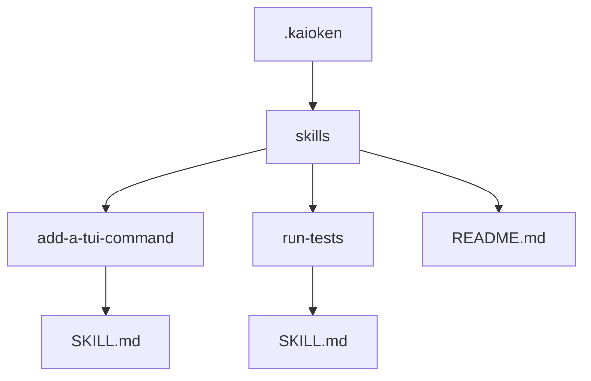
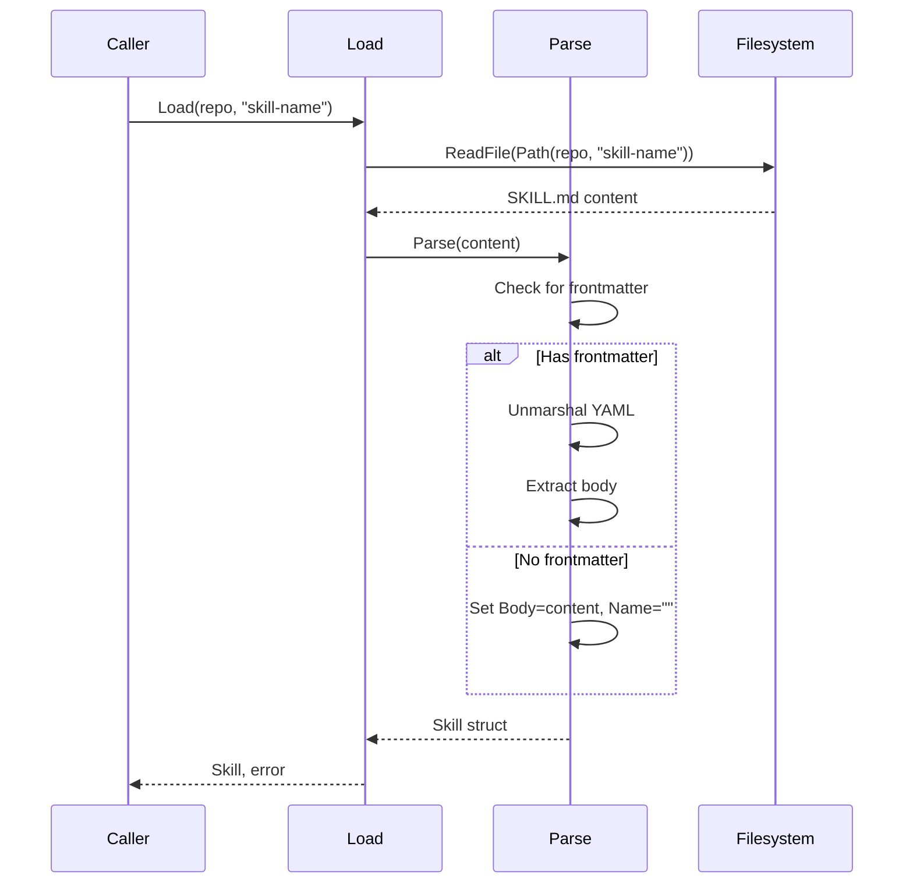

# Skill Storage, Loading, and Indexing

This chapter explains how Kaioken manages project-specific skills: where they are stored, how they are loaded by name, how all skills are listed, and how the skills index is maintained. Skills are task-oriented guides stored in `.kaioken/skills/` that the agent can load to perform repository-specific tasks.

## Table of Contents
- [Skill Storage](#skill-storage)
- [Skill Loading](#skill-loading)
- [Skill Listing](#skill-listing)
- [Skill Index](#skill-index)
- [Skill Staleness](#skill-staleness)
- [Referenced Files](#referenced-files)

## Skill Storage

Skills are stored in a repository-specific directory under `.kaioken/skills/`. Each skill occupies its own subdirectory named using a kebab-case identifier derived from the skill's name, containing a single `SKILL.md` file.

The `Dir` function returns the skills root path for a given repository:
`internal/skills/skills.go:63-63`
```go
func Dir(repo string) string { return filepath.Join(repo, config.Dir, "skills") }
```

The `Path` function constructs the full path to a skill's `SKILL.md` file:
`internal/skills/skills.go:76-78`
```go
func Path(repo, name string) string {
	return filepath.Join(Dir(repo), name, "SKILL.md")
}
```

Skill names are normalized to safe directory names via the `Slug` function, which converts arbitrary strings to kebab-case:
`internal/skills/skills.go:81-105`
```go
// Slug normalises a proposed name into a safe kebab-case directory name.
func Slug(s string) string {
	s = strings.ToLower(strings.TrimSpace(s))
	var b strings.Builder
	lastDash := true // trims leading dashes
	for _, r := range s {
		switch {
		case (r >= 'a' && r <= 'z') || (r >= '0' && r <= '9'):
			b.WriteRune(r)
			lastDash = false
		case r == '-' || r == '_' || r == ' ' || r == '/' || r == '.':
			if !lastDash {
				b.WriteByte('-')
				lastDash = true
			}
		}
	}
	out := strings.Trim(b.String(), "-")
	if out == "" {
		out = "skill"
	}
	if len(out) > 60 {
		out = strings.Trim(out[:60], "-")
	}
	return out
}
```

When saving a skill, the `Save` method creates the skill's directory (if needed) and writes the rendered `SKILL.md`:
`internal/skills/skills.go:118-127`
```go
// Save writes the skill to disk.
func (s *Skill) Save(repo string) error {
	if s.Name == "" {
		return fmt.Errorf("skill has no name")
	}
	dir := filepath.Join(Dir(repo), s.Name)
	if err := os.MkdirAll(dir, 0o755); err != nil {
		return err
	}
	return os.WriteFile(filepath.Join(dir, "SKILL.md"), []byte(s.Render()), 0o644)
}
```

The rendered skill includes YAML frontmatter followed by the skill body:
`internal/skills/skills.go:108-115`
```go
// Render produces the full SKILL.md text: frontmatter then body.
func (s *Skill) Render() string {
	meta := *s
	raw, err := yaml.Marshal(&meta)
	if err != nil {
		raw = []byte("name: " + s.Name + "\n")
	}
	return "---\n" + string(raw) + "---\n\n" + strings.TrimLeft(s.Body, "\n")
}
```

### Skill Directory Structure


## Skill Loading

Individual skills are loaded by name using the `Load` function, which reads the skill's `SKILL.md` file and parses it into a `Skill` struct:
`internal/skills/skills.go:130-136`
```go
// Load reads one skill by name.
func Load(repo, name string) (*Skill, error) {
	raw, err := os.ReadFile(Path(repo, name))
	if err != nil {
		return nil, err
	}
	return Parse(string(raw))
}
```

The `Parse` function handles both formatted skills (with YAML frontmatter) and hand-written skills (without frontmatter):
`internal/skills/skills.go:141-158`
```go
// Parse splits a SKILL.md into frontmatter and body. A file without
// frontmatter is not an error: it is treated as a hand-written skill whose
// name comes from its directory, so a user can drop one in by hand.
func Parse(text string) (*Skill, error) {
	text = strings.ReplaceAll(text, "\r\n", "\n")
	if !strings.HasPrefix(text, "---\n") {
		return &Skill{Body: text}, nil
	}
	rest := text[4:]
	end := strings.Index(rest, "\n---")
	if end == -1 {
		return &Skill{Body: text}, nil
	}
	var s Skill
	if err := yaml.Unmarshal([]byte(rest[:end+1]), &s); err != nil {
		return nil, fmt.Errorf("parsing skill frontmatter: %w", err)
	}
	body := rest[end+4:]
	s.Body = strings.TrimLeft(body, "\n")
	return &s, nil
}
```

For hand-written skills (no frontmatter), the `Name` field remains empty and is later populated from the directory name during listing:
`internal/skills/skills.go:150-152`
```go
	if s.Name == "" {
		s.Name = e.Name() // hand-written skill: fall back to the directory
	}
	s.inferOrigin()
```

### Skill Loading Flow


## Skill Listing

The `List` function returns all skills in a repository, sorted by name. It scans the skills directory for subdirectories, attempts to load each as a skill, and handles malformed skills gracefully:
`internal/skills/skills.go:162-187`
```go
// List returns every skill in a repository, by name. A missing directory means
// none have been generated yet, which is not an error.
func List(repo string) ([]*Skill, error) {
	entries, err := os.ReadDir(Dir(repo))
	if err != nil {
		if os.IsNotExist(err) {
			return nil, nil
		}
		return nil, err
	}
	var out []*Skill
	for _, e := range entries {
		if !e.IsDir() {
			continue
		}
		s, err := Load(repo, e.Name())
		if err != nil {
			continue // a malformed skill must not hide the rest
		}
		if s.Name == "" {
			s.Name = e.Name() // hand-written skill: fall back to the directory
		}
		s.inferOrigin()
		out = append(out, s)
	}
	sort.Slice(out, func(i, j int) bool { return out[i].Name < out[j].Name })
	return out, nil
}
```

Key behaviors:
- Missing skills directory returns empty list (not error)
- Non-directories in skills folder are skipped
- Failed skill loads are skipped (don't hide other skills)
- Hand-written skills (no frontmatter) get their name from directory and their origin is inferred as human (if not already set)
- Skills with a GeneratedAt time have their origin inferred as generated
- Results sorted alphabetically by skill name

### Skill Listing Flow
```mermaid
sequenceDiagram
    participant Caller
    participant List
    participant Filesystem
    participant Load
    
    Caller->>List: List(repo)
    List->>Filesystem: ReadDir(Dir(repo))
    alt Dir missing
        Filesystem-->>List: ErrNotExist
        List-->>Caller: nil, nil
    else Dir exists
        Filesystem-->>List: directory entries
        List->>List: for each entry
            alt Is directory
                List->>Load: Load(repo, dirname)
                Load->>Filesystem: ReadFile(SKILL.md)
                Filesystem-->>Load: content or error
                alt Load success
                    Load-->>List: Skill
                    List->>List: append to results
                else Load error
                    Load-->>List: error
                    List->>List: skip
                end
            else Not directory
                List->>List: skip
            end
        end
        List->>List: sort by name
        List-->>Caller: sorted skills, nil
    end
```

## Skill Index

The skills index is maintained as a `README.md` file in the skills directory (not `skills.yaml` as mentioned in the goal—this appears to be a documentation discrepancy; the code implements `README.md`). This file serves as a catalog for the agent to discover available skills.

The `WriteIndex` function generates this index from a slice of skills:
`internal/skills/skills.go:238-255`
```go
// WriteIndex renders the skills README: the catalog an agent reads to decide
// which skill to open.
func WriteIndex(repo string, all []*Skill) error {
	if len(all) == 0 {
		return nil
	}
	var b strings.Builder
	b.WriteString("# Project Skills\n\n")
	b.WriteString("Task-oriented guides for working in this repository, generated by Kaioken.\n")
	b.WriteString("Each skill says how to perform one recurring task here — which files to\n")
	b.WriteString("touch, in what order, and which local conventions apply.\n\n")
	b.WriteString("Open the skill matching your task before you start.\n\n")
	for _, s := range all {
		fmt.Fprintf(&b, "## [%s](%s/SKILL.md)\n%s\n\n", s.Name, s.Name, s.Description)
	}
	if err := os.MkdirAll(Dir(repo), 0o755); err != nil {
		return err
	}
	return os.WriteFile(filepath.Join(Dir(repo), "README.md"), []byte(b.String()), 0o644)
}
```

The generated index includes:
- A title and explanatory introduction
- For each skill: a level-2 heading with a link to its `SKILL.md` and its description
- Proper directory creation before writing

### Skill Index Example
```markdown
# Project Skills

Task-oriented guides for working in this repository, generated by Kaioken.
Each skill says how to perform one recurring task here — which files to
touch, in what order, and which local conventions apply.

Open the skill matching your task before you start.

## [add-a-tui-command](add-a-tui-command/SKILL.md)
How to add a slash command. Use when adding or changing TUI commands.

## [run-tests](run-tests/SKILL.md)
Running the test suite.
```

## Skill Staleness

Skills can become stale when their source files change. The `Stale` function identifies which skills need regeneration based on changed file paths, using the `intersects` helper to check if any changed path falls under a skill's sources (treated as file or directory prefix):
`internal/skills/skills.go:205-216`
```go
// Stale reports the skills whose sources intersect the changed paths, so an
// update refreshes only what the change actually invalidates.
func Stale(all []*Skill, changed []string) []*Skill {
	if len(changed) == 0 {
		return nil
	}
	var out []*Skill
	for _, s := range all {
		if intersects(s.Sources, changed) {
			out = append(out, s)
		}
	}
	return out
}
```

`intersects` treats each source as either an exact file match or a directory prefix (trailing slash implied):
`internal/skills/skills.go:220-234`
```go
// intersects reports whether any changed path falls under a source entry,
// treating a source as a file or a directory prefix.
func intersects(sources, changed []string) bool {
	for _, src := range sources {
		src = strings.Trim(filepath.ToSlash(strings.TrimSpace(src)), "/")
		if src == "" {
			continue
		}
		for _, c := range changed {
			c = filepath.ToSlash(c)
			if c == src || strings.HasPrefix(c, src+"/") {
				return true
			}
		}
	}
	return false
}
```

### Staleness Examples
| Skill Sources          | Changed Paths             | Stale? | Reason                                  |
|------------------------|---------------------------|--------|-----------------------------------------|
| `["internal/tui/tui.go"]` | `["internal/tui/tui.go"]` | Yes    | Exact file match                        |
| `["internal/llm"]`       | `["internal/llm/stream.go"]` | Yes    | Path under directory prefix             |
| `["internal/llm"]`       | `["internal/llmx/other.go"]` | No     | Prefix stops at separator (`llmx` ≠ `llm`) |
| `["README.md"]`          | `["cmd/kaioken/main.go"]`   | No     | Unrelated change                        |
| Multiple sources       | Matches any source        | Yes    | OR logic across sources                 |

## Referenced Files
- internal/skills/skills.go
- internal/skills/skills_test.go (for behavioral validation)

<!-- kaioken:files internal/skills/skills.go,internal/skills/skills_test.go -->
