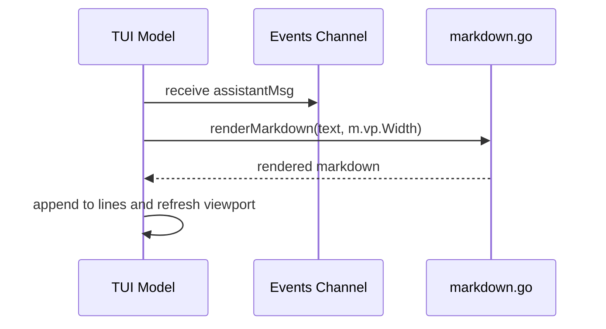

# Terminal User Interface (TUI)

This chapter describes the Bubble Tea-based terminal interface of kaioken, including the command palette, session management, markdown rendering, built-in tutorial, and status line.

## Table of Contents
- [Overview](#overview)
- [Command Palette](#command-palette)
- [Session Management](#session-management)
- [Markdown Rendering](#markdown-rendering)
  - [Overview](#markdown-overview)
  - [Rendering Flow](#markdown-rendering-flow)
  - [Markdown Rendering Implementation](#markdown-rendering-implementation)
  - [Width Handling](#markdown-width-handling)
  - [Configuration](#markdown-configuration)
- [Built-in Tutorial](#built-in-tutorial)
- [Status Line](#status-line)
- [Referenced Files](#referenced-files)

## Overview

The kaioken TUI is built with Bubble Tea and provides an interactive terminal interface for chatting with an AI agent that can read, search, edit, and run commands in the repository. The interface features a command palette for discovering and executing slash commands, persistent session management, deferred markdown rendering for assistant responses, a built-in tutorial, and a status line that displays real-time information.

## Command Palette

The command palette provides intelligent completion for slash commands. As the user types a command after `/`, the palette filters the available commands based on the input. The user can navigate the palette with the arrow keys (or Ctrl+P/Ctrl+N) and select a command with Enter or Tab. The palette is dismissed when a command is selected or when Esc is pressed.

The palette is implemented in the `pal` field of the TUI model and is refreshed on each keystroke to update the completion candidates. It is used exclusively for slash-command completion, distinct from the model and session pickers which use a separate picker mode.

## Session Management

The TUI automatically saves the chat session after each assistant turn. Users can list, resume, and manage sessions via slash commands. Sessions are stored per repository and can be resumed to continue a previous conversation.

Key commands:
- `/sessions`: Lists all saved sessions for the current repository.
- `/resume [id]`: Resumes a session by ID, or opens a session picker if no ID is provided.
- `/reset` or `/new`: Starts a new session after saving the current one.
- `/undo`: Reverts the last file write/edit made by the agent (repeatable to walk further back).

Session data is managed by the `session` package, with the current session stored in the `sess` field of the TUI model. The `saveSession` method persists the conversation, while `resetConversation` initializes a new session with the system prompt.

## Markdown Rendering

### Overview

The TUI defers markdown rendering until an assistant's message is complete to avoid constant reflow during streaming. While the LLM streams tokens, the live region shows raw text. Upon completion, the full message is processed by the `glamour` library to produce terminal-styled output that honors the terminal's background, wraps text to the viewport width, and supports emoji.

### Rendering Flow

When the LLM finishes generating an assistant response, the TUI follows this sequence:

1. The LLM sends the complete assistant text via an `assistantMsg` on the TUI's `events` channel.
2. The `Update` method handles `assistantMsg` by:
   - Clearing the live-streamed region (`m.live = ""`)
   - Passing the text and current viewport width to `renderMarkdown`
   - Appending the rendered result to the scrollback (`m.lines`)
   - Refreshing the viewport to display the new content



`internal/tui/tui.go:330-337`
```go
case assistantMsg:
	// The live region showed raw tokens as they arrived; replace it with
	// the markdown-rendered version now that the reply is complete.
	m.live = ""
	m.appendLine(renderMarkdown(msg.text, m.vp.Width))
	return m, listen(m.events)
```

### Markdown Rendering Implementation

The `renderMarkdown` function in `internal/tui/markdown.go` performs the actual conversion. It first checks if rendering is worthwhile:
- Returns early (with only assistant-style coloring) if width < 20 or if the text lacks markdown structure (determined by `looksLikeMarkdown`)
- Otherwise, uses a cached `glamour.TermRenderer` configured with:
  - `glamour.WithAutoStyle()`: adapts to terminal light/dark background
  - `glamour.WithWordWrap(width)`: wraps text at the given width
  - `glamour.WithEmoji()`: enables emoji rendering

The renderer is recreated only when the width changes, minimizing overhead.

`internal/tui/markdown.go:45-59`
```go
func renderMarkdown(text string, width int) string {
	if width < 20 || !looksLikeMarkdown(text) {
		return assistantStyle.Render(text)
	}
	r := markdownRenderer(width)
	if r == nil {
		return assistantStyle.Render(text)
	}
	out, err := r.Render(text)
	if err != nil {
		return assistantStyle.Render(text)
	}
	// Glamour frames blocks with blank lines; the TUI adds its own spacing.
	return strings.Trim(out, "\n")
}
```

The `looksLikeMarkdown` helper detects structural markdown elements to avoid unnecessary processing for plain text:

`internal/tui/markdown.go:64-83`
```go
func looksLikeMarkdown(text string) bool {
	if strings.Contains(text, "```") {
		return true
	}
	structural := 0
	for _, line := range strings.Split(text, "\n") {
		t := strings.TrimSpace(line)
		switch {
		case strings.HasPrefix(t, "#"),
			strings.HasPrefix(t, "- "), strings.HasPrefix(t, "* "),
			strings.HasPrefix(t, "> "), strings.HasPrefix(t, "|"),
			strings.HasPrefix(t, "1. "):
			structural++
		}
		if strings.Contains(t, "**") || strings.Contains(t, "`") {
			structural++
		}
	}
	return structural >= 2
}
```

Renderer caching ensures efficiency across resizes:

`internal/tui/markdown.go:24-40`
```go
func markdownRenderer(width int) *glamour.TermRenderer {
	rendererMu.Lock()
	defer rendererMu.Unlock()
	if renderer != nil && rendererWidth == width {
		return renderer
	}
	r, err := glamour.NewTermRenderer(
		glamour.WithAutoStyle(), // honors the terminal's light/dark background
		glamour.WithWordWrap(width),
		glamour.WithEmoji(),
	)
	if err != nil {
		return nil
	}
	renderer, rendererWidth = r, width
	return r
}
```

Global state for the renderer cache:

`internal/tui/markdown.go:17-19`
```go
var (
	rendererMu    sync.Mutex
	renderer      *glamour.TermRenderer
	rendererWidth int
)
```

### Width Handling

The viewport width (`m.vp.Width`) drives markdown rendering and is updated on terminal resize:
- On `tea.WindowSizeMsg`, the TUI sets `m.width, m.height = msg.Width, msg.Height` and updates the viewport (`m.vp.Width = msg.Width`)
- The cached scrollback wrap (`m.committed`) is invalidated (`m.committed = ""`) because width changes require re-wrapping
- The `markdownRenderer` function checks `rendererWidth` against the requested width to recreate the renderer only when necessary

This ensures markdown output always fits the current terminal width without manual reconfiguration.

### Configuration

Markdown rendering has no user-configurable options. Behavior is fixed to:
- Use `glamour` with auto-styling for terminal theme adaptation
- Apply word wrapping at the current viewport width
- Enable emoji rendering
- Fallback to plain assistant-style text for narrow widths (<20) or non-markdown content

All configuration relates to the viewport width, which is dynamically derived from the terminal size.

## Built-in Tutorial

The TUI includes a built-in tutorial accessible via `/tutorial`, `/guide`, or `/manual`. The tutorial provides an overview of the available commands and features, helping new users get started. When invoked, it displays a series of formatted lines explaining core functionality such as chat interaction, tool usage, session management, and knowledge engine commands.

The tutorial content is generated by the `tutorialLines` function (not shown in the provided files) and is rendered directly to the scrollback without markdown processing, as it consists of plain instructional text.

## Status Line

The status line is located at the bottom of the screen, just above the input area. It provides real-time feedback on the application state. The left side shows context-sensitive hints and status indicators (such as busy state with elapsed time), while the right side shows session information including the current model, token usage, and whether the wiki is being served. When auto-approve mode is enabled, the status line displays a prominent "yolo" warning.

The left section dynamically changes based on state:
- When busy: shows a spinner, current operation text, elapsed time, and a hint to press Esc to stop.
- When idle: shows hints for accessing commands (`/`), inserting newlines (Alt+Enter), and quitting (Ctrl+D).

The right section combines:
- "serving" if the wiki browser is active
- The current model name (shortened to fit)
- Token usage (prompt + completion tokens) if available
- The "yolo" warning (in yellow) when auto-approve is enabled, separated by a dot

This layout ensures critical information remains visible without cluttering the interface, adapting to narrow terminals by prioritizing the left-side hints when space is limited.

## Referenced Files
- internal/tui/tui.go
- internal/tui/markdown.go

<!-- kaioken:files internal/tui/markdown.go,internal/tui/tui.go -->
