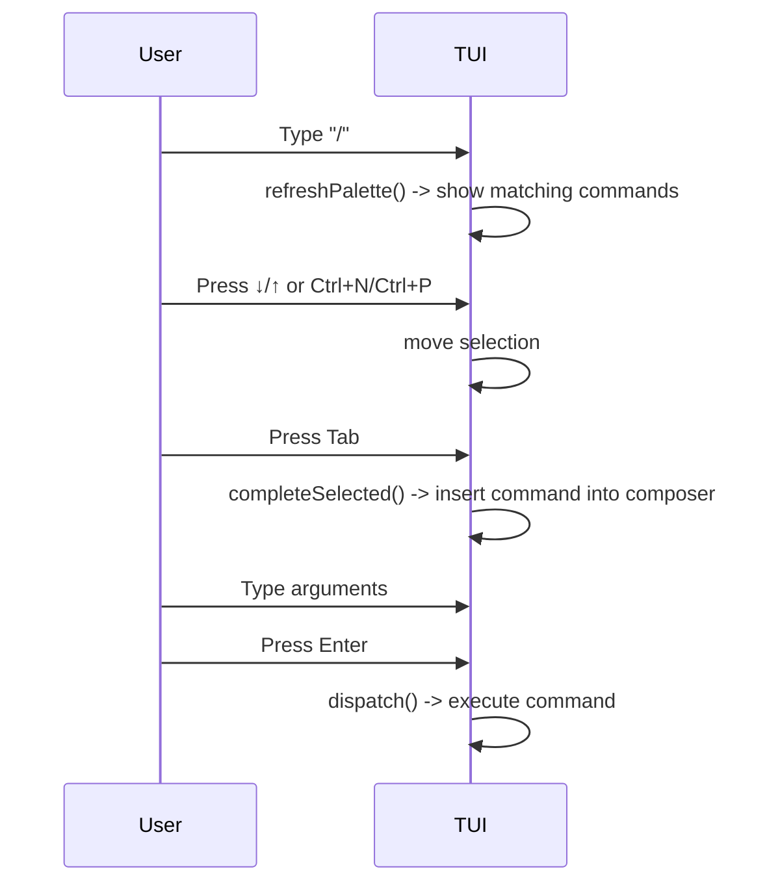

# Terminal User Interface (TUI)

The Terminal User Interface (TUI) is kaioken's interactive interface built with the Bubble Tea library. It provides a chat-based interface for interacting with the AI agent, managing sessions, executing slash commands, rendering markdown responses, and displaying contextual status information.

## Table of Contents
- [Model Structure](#model-structure)
- [Modes and Update Loop](#modes-and-update-loop)
- [Command Palette](#command-palette)
- [Markdown Rendering](#markdown-rendering)
- [Built-in Tutorial](#built-in-tutorial)
- [Status Line](#status-line)
- [Session Management](#session-management)
- [Approval Workflow](#approval-workflow)
- [Keybindings](#keybindings)
- [Referenced Files](#referenced-files)

## Model Structure

The TUI state is encapsulated in the `Model` struct ([cli/internal/tui/tui.go:127-185](#cli/internal/tui/tui.go:127-185)). It holds:

- **Repository and configuration**: `repo`, `cfg`, `global`, `apiKeys`, `client`
- **Conversation state**: `conversation`, `autoApprove`, `undoStack`, `sess`
- **UI components**: `vp` (viewport), `input` (textarea), `keyInput` (textinput for hidden key entry), `spin` (spinner), `list` (for pickers), `events` (channel for async messages), `approvals` (channel for approval responses)
- **Display state**: `lines` (scrollback), `committed` (cached wrapped scrollback), `live` (streaming assistant text), `busy` and `busyText` (for long operations), `busyStart` (timer for busy state), `mode` (chat or picker)
- **Command palette**: `pal` (palette state), `pendingKey`, `pendingApproval`, `approval` (current approval request), `cancel` (context cancel for ongoing operations)
- **Wiki browser**: `serveCancel`, `serveURL`
- **Flags**: `configMissing`, `suggestedSkills`, `width`, `height`, `ready`

The `Model` is initialized by `New` ([cli/internal/tui/tui.go:198-261](#cli/internal/tui/tui.go:198-261)) and run by `Run` ([cli/internal/tui/tui.go:188-195](#cli/internal/tui/tui.go:188-195)).

## Modes and Update Loop

The TUI operates in two modes:
- `modeChat`: normal chat input and command processing
- `modePicker`: model or session selection (see [cli/internal/tui/tui.go:47-51](#cli/internal/tui/tui.go:47-51))

The main update loop is in the `Update` method ([cli/internal/tui/tui.go:288-428](#cli/internal/tui/tui.go:288-428)), which handles:
- Window resizing
- Key presses (via `onKey`)
- Spinner ticks (when busy)
- Async messages from the agent and other operations (logMsg, busyMsg, doneMsg, approvalReqMsg, agentDoneMsg, modelsFetchedMsg, serveStartedMsg, serveStoppedMsg, undoRecordMsg, compactedMsg, streamDeltaMsg, assistantMsg)

The `onKey` method ([cli/internal/tui/tui.go:430-569](#cli/internal/tui/tui.go:430-569)) processes key presses differently based on the current mode and state (e.g., in picker mode, during approval, when the palette is open, etc.).

### Update Loop Diagram
```mermaid
graph TD
    A[tea.Msg] --> B{Msg Type}
    B -->|spinner.TickMsg| C[Update spinner if busy]
    B -->|logMsg| D[Flush live and append line]
    B -->|streamDeltaMsg| E[Append to live and refresh viewport]
    B -->|assistantMsg| F[Replace live with rendered markdown and append]
    B -->|busyMsg| G[Set busy state and start/stop spinner]
    B -->|doneMsg| H[Handle completion (e.g., wiki done) and possibly suggest skills]
    B -->|approvalReqMsg| I[Show approval prompt]
    B -->|agentDoneMsg| J[Update conversation and save session]
    B -->|modelsFetchedMsg| K[Populate model picker list]
    B -->|serveStartedMsg/serveStoppedMsg| L[Update serve URL and append line]
    B -->|undoRecordMsg| M[Add to undo stack]
    B -->|compactedMsg| N[Replace conversation with summary and append line]
    B -->|tea.KeyMsg| O[onKey handler]
    B -->|tea.WindowSizeMsg| P[Handle resize]
```

## Command Palette

The command palette is opened by typing `/` and provides fuzzy completion for slash commands. It is implemented in [cli/internal/tui/palette.go](#cli/internal/tui/palette.go).

Key components:
- `palette` struct: tracks active state, list of commands, selected index, and offset for scrolling.
- `refreshPalette` ([cli/internal/tui/tui.go:43-70](#cli/internal/tui/tui.go:43-70)): called on input change to populate the palette with matching commands.
- Navigation: up/down (or ctrl+p/ctrl+n) to move selection, tab to complete, enter to run, esc to close.
- Rendering: `paletteView` ([cli/internal/tui/palette.go:139-192](#cli/internal/tui/palette.go:139-192)) formats the menu above the composer.

The palette only appears when the composer starts with `/` and no space (indicating the command name is being typed). Once a space is typed, the palette dismisses and the user types arguments.

### Palette Navigation Diagram


## Markdown Rendering

Assistant responses are rendered as markdown using the `glamour` library. Rendering is deferred until the assistant's message is complete to avoid continuous reflow during streaming.

See [cli/internal/tui/markdown.go](#cli/internal/tui/markdown.go):
- `markdownRenderer` ([cli/internal/tui/markdown.go:24-40](#cli/internal/tui/markdown.go:24-40)): returns a `glamour.TermRenderer` for the given viewport width, caching it until the width changes.
- `renderMarkdown` ([cli/internal/tui/markdown.go:45-59](#cli/internal/tui/markdown.go:45-59)): styles the assistant's complete message. If the width is too small or the text doesn't look like markdown, it falls back to plain styling.
- `looksLikeMarkdown` ([cli/internal/tui/markdown.go:64-83](#cli/internal/tui/markdown.go:64-83)): checks for markdown structures (code fences, headers, lists, etc.) to decide whether to render.

The TUI uses this in the `assistantMsg` handler ([cli/internal/tui/tui.go:571-588](#cli/internal/tui/tui.go:571-588)) to replace the raw streamed text (`live`) with the rendered markdown.

## Built-in Tutorial

The `/tutorial` command provides an interactive manual. It is implemented in [cli/internal/tui/tutorial.go](#cli/internal/tui/tutorial.go).

The tutorial is organized into chapters (e.g., "start", "chat", "sessions", etc.), each containing a set of commands. The tutorial data is in the `chapters` variable ([cli/internal/tui/tutorial.go:29-89](#cli/internal/tui/tutorial.go:29-89)).

Functions:
- `tutorialOverview` ([cli/internal/tui/tutorial.go:119-167](#cli/internal/tui/tutorial.go:119-167)): returns the landing page.
- `tutorialChapter` ([cli/internal/tui/tutorial.go:170-187](#cli/internal/tui/tutorial.go:170-187)): returns a specific chapter.
- `tutorialCommand` ([cli/internal/tui/tutorial.go:190-224](#cli/internal/tui/tutorial.go:190-224)): returns the details for a single command.
- `tutorialLines` ([cli/internal/tui/tutorial.go:227-263](#cli/internal/tui/tutorial.go:227-263)): resolves an argument (chapter name, command name, or "all") to the appropriate tutorial text.

The tutorial is displayed by appending lines to the scrollback via `appendLine` (see the `dispatch` method for the "tutorial" command in [cli/internal/tui/tui.go:927-1050](#cli/internal/tui/tui.go:927-1050)).

## Status Line

The status line is the single row under the composer, showing contextual

<!-- kaioken:files internal/tui/tui.go,internal/tui/palette.go,internal/tui/markdown.go,internal/tui/tutorial.go -->
