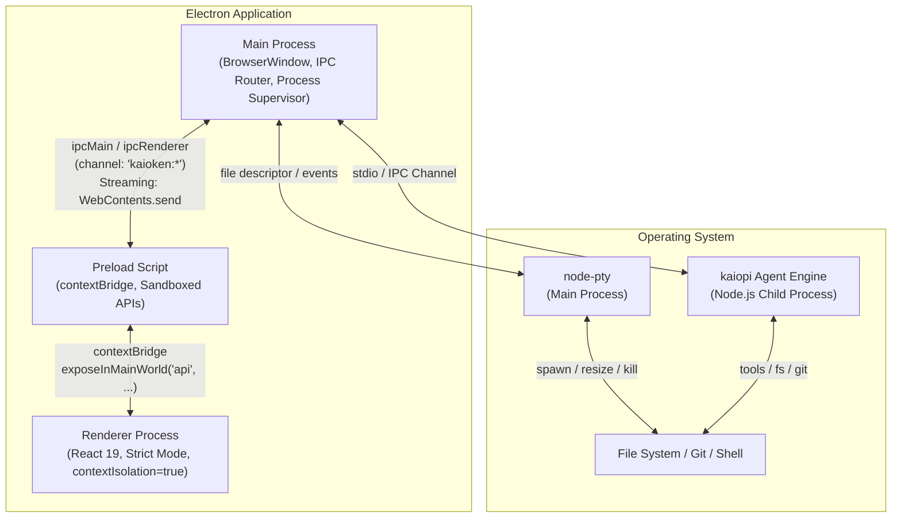
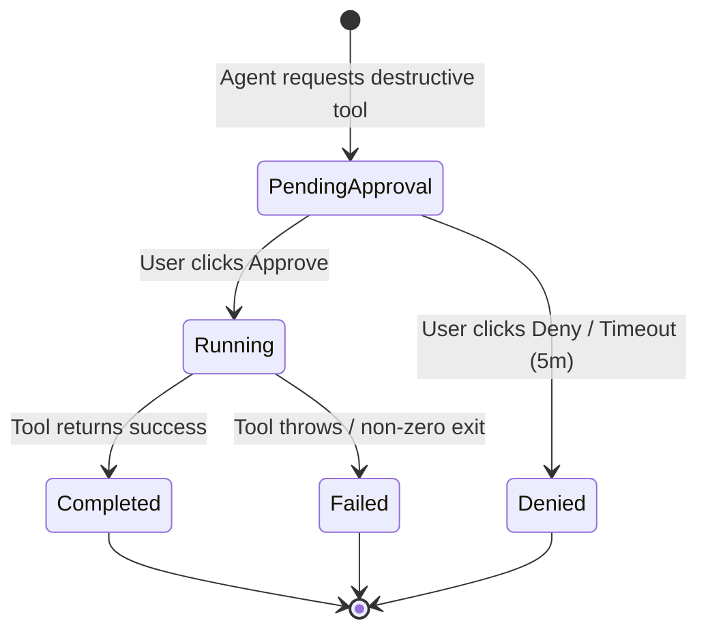

# KAIOKEN DESKTOP STUDIO — ARCHITECTURAL BLUEPRINT & PHASED IMPLEMENTATION PLAN
**Classification:** Principal Desktop Architect / Staff Systems Engineer Deliverable  
**Version:** 1.0 — Production Grade  
**Target:** `desktop/` (Electron 44 + React 19 + `kaiopi` Runtime)

---

## PART 1: SYSTEM TOPOLOGY & IPC PROTOCOL SPECIFICATION

### 1.1 Process Model & Trust Boundaries



**Trust Boundary Decisions:**
| Boundary | Mechanism | Rationale |
| :--- | :--- | :--- |
| **Main ↔ Renderer** | `contextBridge` + `ipcRenderer.invoke` (request/response) + `ipcRenderer.on` (streams) | Strict sandbox; no `nodeIntegration`. Preload validates all payloads via Zod schemas. |
| **Main ↔ `kaiopi`** | **Spawned Child Process (stdio)** + **Length-Delimited JSON Framing** | `kaiopi` is heavy (AST indexes, LLM clients). Crashes must not kill UI. Independent GC heap. Restartable. |
| **Main ↔ `node-pty`** | In-Process (Main) `EventEmitter` | PTY *must* run in Main for raw FD access. Wrapped in `PtySessionManager` class. |
| **Renderer ↔ PTY** | Main proxies `data`/`resize`/`exit` events over dedicated IPC channels per session ID. | Renderer never touches `node-pty`. |

---

### 1.2 `kaiopi` Hosting Strategy: **Managed Child Process with Health Protocol**

**Why not In-Process (Worker Thread)?**
- `kaiopi` loads 17+ Kaioken packages + `pi-agent-core` + LLM SDKs (~200MB heap baseline).
- Native dependencies (`tree-sitter` WASM binaries, `node-pty` if used internally) conflict with Electron's V8 isolate.
- **Process Isolation** allows independent versioning, crash recovery, and `--inspect` debugging.

**Protocol: `kaiopi-wire` (Length-Delimited JSON over stdio)**
```typescript
// packages/kaiopi-wire/src/protocol.ts
export const FRAME_DELIMITER = '\n'; // JSONL - simple, streaming friendly

export interface WireEnvelope<T = unknown> {
  id: string;              // UUID v7 (timestamp sortable)
  type: 'request' | 'response' | 'event' | 'heartbeat' | 'error';
  namespace: 'agent' | 'index' | 'verify' | 'gitops' | 'modelport' | 'system';
  method: string;          // e.g., 'agent.run', 'index.query', 'verify.gate'
  payload: T;
  meta?: {
    correlationId?: string; // Links response to request
    stream?: boolean;       // True for token deltas / progress
    seq?: number;           // Sequence for ordering reassembly
    final?: boolean;        // Last chunk in stream
  };
}

// Heartbeat: Sent every 5s by both sides. 3 missed = force kill/restart.
export const HEARTBEAT_INTERVAL_MS = 5000;
export const HEARTBEAT_MAX_MISSED = 3;
```

**Main Process Supervisor (`src/main/services/KaiopiSupervisor.ts`):**
- Spawns `node --enable-source-maps dist/kaiopi/cli.js --stdio` (compiled `kaiopi` entry).
- Manages `stdin` write queue (backpressure via `drain` event).
- Parses `stdout` by `FRAME_DELIMITER`, validates `WireEnvelope` via Zod.
- Emits typed events: `kaiopi:event`, `kaiopi:response`, `kaiopi:crash`.
- **Restart Policy:** Exponential backoff (1s, 2s, 4s, 8s, max 30s). Max 5 restarts/minute before UI alert.

---

### 1.3 IPC Contract: `window.api` (TypeScript Definitions)

**File:** `src/preload/api-contracts.ts` (Shared types imported by Main, Preload, Renderer)

```typescript
// ==========================================
// CORE PRIMITIVES
// ==========================================
export type SessionId = string & { readonly __brand: unique symbol };
export type PtySessionId = string & { readonly __brand: unique symbol };
export type RequestId = string & { readonly __brand: unique symbol };

export interface Paginated<T> { items: T[]; cursor?: string; total?: number; }

// ==========================================
// AGENT NAMESPACE (window.api.agent)
// ==========================================
export interface AgentRunRequest {
  prompt: string;
  sessionId?: SessionId;          // Continue existing
  modelProfile?: string;          // 'kaiopi-default', 'reasoning-heavy', 'speed'
  multiplier?: number;            // 1..10 (Kaioken Dial)
  toolsAllowed?: string[];        // Tool allowlist for this run
  contextFiles?: string[];        // Explicit file refs @path
}

export interface AgentTokenDelta {
  sessionId: SessionId;
  requestId: RequestId;
  delta: string;                  // Raw token string
  reasoning?: string;             // Separate reasoning stream (o1, etc.)
}

export interface AgentToolCall {
  sessionId: SessionId;
  requestId: RequestId;
  callId: string;
  tool: string;                   // 'run_command', 'write_to_file', 'kaioken.index.query', etc.
  input: Record<string, unknown>;
  status: 'pending_approval' | 'running' | 'completed' | 'failed' | 'denied';
  output?: unknown;
  error?: string;
  // For destructive tools:
  approvalMetadata?: {
    diffPreview?: string;         // Unified diff for write/apply_patch
    commandPreview?: string;      // Command for run_command
    riskLevel: 'low' | 'medium' | 'critical';
    timeoutMs: number;            // Default 300_000 (5 min)
  };
}

export interface AgentSessionState {
  id: SessionId;
  title: string;
  createdAt: number;
  updatedAt: number;
  messageCount: number;
  tokenUsage: { input: number; output: number; costUsd: number };
  status: 'idle' | 'streaming' | 'tool_executing' | 'awaiting_approval' | 'error';
}

export interface AgentNamespace {
  // Request/Response (invoke)
  newSession: (opts?: { title?: string }) => Promise<AgentSessionState>;
  getSession: (id: SessionId) => Promise<AgentSessionState | null>;
  listSessions: (opts?: { limit: number; cursor?: string }) => Promise<Paginated<AgentSessionState>>;
  deleteSession: (id: SessionId) => Promise<void>;
  
  run: (req: AgentRunRequest) => Promise<{ sessionId: SessionId; requestId: RequestId }>;
  abort: (sessionId: SessionId, requestId: RequestId) => Promise<void>;
  approveTool: (sessionId: SessionId, callId: string, approved: boolean, modifiedInput?: Record<string, unknown>) => Promise<void>;
  
  // Streams (on/off)
  onToken: (handler: (delta: AgentTokenDelta) => void) => () => void;
  onToolUpdate: (handler: (call: AgentToolCall) => void) => () => void;
  onSessionStatus: (handler: (state: AgentSessionState) => void) => () => void;
}

// ==========================================
// PTY NAMESPACE (window.api.pty)
// ==========================================
export interface PtySpawnOptions {
  shell?: string;                 // 'powershell', 'cmd', 'bash', 'zsh', 'fish'
  cwd?: string;
  cols: number;
  rows: number;
  env?: Record<string, string>;
  name?: string;                  // Human label
}

export interface PtyNamespace {
  spawn: (opts: PtySpawnOptions) => Promise<{ sessionId: PtySessionId }>;
  kill: (sessionId: PtySessionId) => Promise<void>;
  resize: (sessionId: PtySessionId, cols: number, rows: number) => Promise<void>;
  write: (sessionId: PtySessionId, data: string) => Promise<void>;
  
  onData: (sessionId: PtySessionId, handler: (data: string) => void) => () => void;
  onExit: (sessionId: PtySessionId, handler: (code: number, signal?: number) => void) => () => void;
}

// ==========================================
// WORKSPACE NAMESPACE (window.api.workspace)
// ==========================================
export interface FileNode {
  path: string;           // Relative to workspace root
  name: string;
  type: 'file' | 'directory' | 'symlink';
  size?: number;
  mtimeMs?: number;
  gitStatus?: 'unmodified' | 'modified' | 'added' | 'deleted' | 'untracked' | 'ignored';
  children?: FileNode[];  // Only if directory & expanded
}

export interface WorkspaceNamespace {
  getRoot: () => Promise<string>;
  setRoot: (path: string) => Promise<void>;
  readFile: (path: string) => Promise<string>;
  writeFile: (path: string, content: string) => Promise<void>; // Goes through approval gate!
  listDir: (path: string, depth?: number) => Promise<FileNode[]>;
  watch: (path: string) => Promise<{ unwatch: () => void }>; // Returns unwatch fn
  // Kaioken specific
  indexStatus: () => Promise<{ indexed: boolean; files: symbols: number; lastUpdate: number }>;
  reindex: (force?: boolean) => Promise<void>;
  search: (query: string, opts?: { lexical?: boolean; semantic?: boolean; limit?: number }) => Promise<SearchResult[]>;
}

// ==========================================
// TOOLS / DESTRUCTIVE GATE NAMESPACE (window.api.tools)
// ==========================================
export interface ApprovalRequest {
  id: string;
  tool: string;
  title: string;
  description: string;
  riskLevel: 'low' | 'medium' | 'critical';
  preview: {
    type: 'diff' | 'command' | 'json' | 'text';
    content: string;
    language?: string;
  };
  timeoutMs: number;
  createdAt: number;
}

export interface ToolsNamespace {
  // Called by Main when Agent requests approval
  onApprovalRequest: (handler: (req: ApprovalRequest) => void) => () => void;
  // Renderer calls this after user interaction
  resolveApproval: (id: string, approved: boolean, modifiedInput?: unknown) => Promise<void>;
}
```

---

### 1.4 Stream Buffering & Backpressure Strategy (60 FPS Guarantee)

**Problem:** LLM tokens arrive at ~50-100 tokens/sec. Tool events burst. Naive `ipcRenderer.send` per token → Main Process event loop saturation → Renderer microtask queue overflow → Jank.

**Solution: Triple-Layer Buffering**

| Layer | Location | Mechanism | Flush Trigger |
| :--- | :--- | :--- | :--- |
| **L1: Agent-Side** | `kaiopi` Child Process | Accumulate tokens in 16KB buffer / 16ms timer. Send `WireEnvelope` with `stream: true, final: false`. | Buffer full OR 16ms elapsed (≈60fps). |
| **L2: Main Process IPC Router** | `src/main/ipc/stream-router.ts` | `TransformStream` per `sessionId`. Batches incoming `AgentTokenDelta` into `AgentTokenBatch { deltas: Delta[] }`. Uses `setImmediate` drain. | 4ms micro-batch OR 64 deltas. |
| **L3: Renderer Subscription** | `src/renderer/lib/stream-batcher.ts` | Custom React hook `useBatchedStream`. Accumulates deltas in `useRef` string buffer. Triggers `setState` via `requestAnimationFrame` (rAF). | rAF callback (browser paint sync). |

**Renderer Hook Implementation Sketch:**
```typescript
// src/renderer/lib/stream-batcher.ts
export function useBatchedStream<T>(
  onEvent: (handler: (batch: T[]) => void) => () => void,
  map: (raw: unknown) => T
) {
  const bufferRef = useRef<T[]>([]);
  const rafRef = useRef<number>();
  const [, forceUpdate] = useReducer(x => x + 1, 0);

  const flush = useCallback(() => {
    if (bufferRef.current.length === 0) return;
    const batch = bufferRef.current.splice(0);
    // Single state update per frame
    forceUpdate(n => n + 1); 
    // Process batch in components via context/store
    streamContext.current?.pushBatch(batch); 
  }, []);

  useEffect(() => {
    const unsub = onEvent((raw) => {
      bufferRef.current.push(map(raw));
      if (!rafRef.current) rafRef.current = requestAnimationFrame(() => {
        rafRef.current = 0;
        flush();
      });
    });
    return () => { unsub(); if (rafRef.current) cancelAnimationFrame(rafRef.current); };
  }, [onEvent, flush]);

  return flush;
}
```
*Result: Renderer commits **max 1 React render per frame** regardless of token velocity.*

---

## PART 2: COMPLETE PROJECT FILE TREE & COMPONENT HIERARCHY

### 2.1 `desktop/` Directory Structure

```text
desktop/
├── package.json                     # Root workspace (npm workspaces)
├── tsconfig.base.json               # Project references config
├── electron.vite.config.ts          # electron-vite config (Main, Preload, Renderer)
├── tailwind.config.ts               # Tailwind v4 + Kaioken ANSI theme
├── .eslintrc.cjs
├── .prettierrc
│
├── packages/                        # Local packages (optional, for shared types)
│   └── kaiopi-wire/                 # IPC Protocol definitions (published internally)
│
├── src/
│   ├── main/                        # ELECTRON MAIN PROCESS
│   │   ├── index.ts                 # Entry: Boot, Window, IPC Registration
│   │   ├── window/
│   │   │   ├── WindowManager.ts     # BrowserWindow lifecycle, frameless, vibrancy
│   │   │   └── TitlebarController.ts# Custom drag regions, traffic lights
│   │   ├── ipc/
│   │   │   ├── index.ts             # IPC Router registration
│   │   │   ├── handlers/
│   │   │   │   ├── agent.ts         # agent:* invoke handlers
│   │   │   │   ├── pty.ts           # pty:* invoke + stream handlers
│   │   │   │   ├── workspace.ts     # workspace:* handlers
│   │   │   │   └── tools.ts         # Approval gate handlers
│   │   │   ├── stream-router.ts     # L2 Buffering (TransformStream per session)
│   │   │   └── approval-gate.ts     # Modal orchestration, focus trap, timeout
│   │   ├── services/
│   │   │   ├── KaiopiSupervisor.ts  # Child process lifecycle, wire protocol
│   │   │   ├── PtySessionManager.ts # node-pty lifecycle, resize, encoding
│   │   │   ├── WorkspaceService.ts  # File watchers, git status, Kaioken index bridge
│   │   │   └── ConfigService.ts     # Persistent settings (electron-store)
│   │   └── utils/
│   │       ├── framing.ts           # Length-delimited JSON parser
│   │       └── security.ts          # Path validation, command allowlist
│   │
│   ├── preload/                     # PRELOAD SCRIPT (Sandboxed)
│   │   ├── index.ts                 # contextBridge.exposeInMainWorld('api', ...)
│   │   ├── api-contracts.ts         # **SINGLE SOURCE OF TRUTH** for types (copied to renderer via tsconfig)
│   │   ├── ipc-renderer.ts          # Typed wrappers for ipcRenderer.invoke/on
│   │   └── polyfills.ts             # EventTarget, Blob, etc. if needed
│   │
│   └── renderer/                    # REACT 19 RENDERER (Vite + React 19)
│       ├── index.html
│       ├── main.tsx                 # Hydration root, Providers
│       ├── App.tsx                  # Root Layout (SplitPanels, Providers)
│       ├── vite-env.d.ts
│       │
│       ├── lib/                     # CORE CLIENT INFRASTRUCTURE
│       │   ├── stores/              # Zustand Stores (Partitioned by Domain)
│       │   │   ├── index.ts         # Store registry, persistence middleware
│       │   │   ├── sessionStore.ts  # Agent sessions, messages, streaming state
│       │   │   ├── agentStore.ts    # Current run state, multiplier dial, tool calls
│       │   │   ├── terminalStore.ts # PTY sessions, buffers, active session
│       │   │   ├── explorerStore.ts # File tree, git status, search results
│       │   │   ├── diffStore.ts     # Diff hunks, accept/reject state
│       │   │   ├── uiStore.ts       # Layout split ratios, drawer visibility, theme
│       │   │   └── approvalStore.ts # Pending approval queue (modal stack)
│       │   ├── hooks/
│       │   │   ├── useIpc.ts        # Typed IPC invoke/on wrappers
│       │   │   ├── useBatchedStream.ts # L3 Batching (see Part 1.4)
│       │   │   ├── usePty.ts        # PTY session lifecycle
│       │   │   └── useKeyboard.ts   # Global accelerators (Ctrl+K, Ctrl+1-9)
│       │   ├── components/          # SHARED PRIMITIVES (Design System)
│       │   │   ├── primitives/      # Box, Text, Button, Input, ScrollArea, Separator
│       │   │   ├── hud/             # HUDCorner, Scanlines, EnergyPulse, MultiplierDial
│       │   │   ├── markdown/        # StreamingMarkdown, KaTeX, Mermaid, CitationChip
│       │   │   ├── diff/            # DiffHunk, SideBySideDiffViewer, InlineDiff
│       │   │   ├── terminal/        # TerminalPane, XtermWrapper, TerminalToolbar
│       │   │   ├── modals/          # ApprovalModal, ConfirmDialog, CommandPalette
│       │   │   └── layout/          # SplitPane, ResizablePanel, DockPanel, TabBar
│       │   ├── utils/
│       │   │   ├── ansi.ts          # ANSI parser for terminal output
│       │   │   ├── diff.ts          # Diff parsing (unified -> hunks)
│       │   │   └── format.ts        # Token formatting, cost calc
│       │   └── styles/
│       │       ├── globals.css      # @tailwind base; @theme { --color-ansi-cyan: #00e5ff; }
│       │       └── variables.css    # CSS Custom Properties for HUD animations
│       │
│       ├── features/                # FEATURE VERTICAL SLICES (Navigation Surfaces)
│       │   ├── chat/                # LEFT NAV: Chat / Agent Control
│       │   │   ├── ChatSurface.tsx
│       │   │   ├── MessageList.tsx
│       │   │   ├── MessageBubble.tsx
│       │   │   ├── Composer.tsx     # Input, @mentions, model selector, multiplier dial
│       │   │   └── ToolCallCard.tsx # Collapsible tool execution card
│       │   ├── research/            # Research / Deep Dive
│       │   ├── wiki/                # Wiki / Documentation Viewer
│       │   ├── codemap/             # Codemap Graph (Mermaid/Force Graph)
│       │   │   ├── GraphSurface.tsx
│       │   │   └── GraphCanvas.tsx  # React Flow / Cytoscape / Mermaid Live
│       │   ├── cards/               # Knowledge Cards Browser
│       │   ├── ledger/              # Cost Ledger (Modelport)
│       │   └── settings/            # Settings Surface
│       │
│       ├── inspector/               # RIGHT DYNAMIC INSPECTOR PANEL
│       │   ├── InspectorHost.tsx    # Tabbed container (Diff, File, Graph, Terminal)
│       │   ├── DiffInspector.tsx    # Side-by-side diff with per-hunk actions
│       │   ├── FileInspector.tsx    # CodeMirror 6 read-only + annotations
│       │   ├── GraphInspector.tsx   # Mermaid / Graph detail view
│       │   └── TerminalInspector.tsx# Embedded terminal (alternative to bottom drawer)
│       │
│       └── layout/                  # TOP-LEVEL LAYOUT COMPOSITION
│           ├── RootLayout.tsx       # CSS Grid: Nav | Center | Inspector | BottomDrawer
│           ├── NavRail.tsx          # Left rail (7 surfaces)
│           ├── CenterPane.tsx       # Agent Stream (ChatSurface)
│           ├── InspectorPane.tsx    # Right pane (InspectorHost)
│           └── TerminalDrawer.tsx   # Bottom collapsible drawer (TerminalPane)
```

### 2.2 Navigation Surface Mapping (7 Primary Surfaces)

| Index | Surface | Key Components | Data Dependencies |
| :--- | :--- | :--- | :--- |
| **1** | **Chat / Agent** | `ChatSurface`, `Composer`, `MessageList`, `ToolCallCard` | `sessionStore`, `agentStore`, `approvalStore` |
| **2** | **Research** | `ResearchSurface`, `PlanView`, `CitationGraph` | `sessionStore` (plan cards), `kaioken/plan` |
| **3** | **Wiki** | `WikiSurface`, `ArticleViewer`, `TocNav` | `kaioken/wiki` serve daemon (iframe or fetch) |
| **4** | **Codemap** | `GraphSurface`, `GraphCanvas` (React Flow) | `kaioken/impact` graph data, `kaioken/index` symbols |
| **5** | **Cards** | `CardsSurface`, `CardGrid`, `CardDetail` | `kaioken/cards` index |
| **6** | **Ledger** | `LedgerSurface`, `CostChart`, `TokenBreakdown` | `kaioken/modelport` API |
| **7** | **Settings** | `SettingsSurface`, `ApiKeyVault`, `ThemeEditor`, `KeybindEditor` | `ConfigService` (electron-store) |

---

## PART 3: CORE IMPLEMENTATION DEEP-DIVE

### 3.1 The PTY & Terminal Bridge

#### A. Main Process: `src/main/ipc/pty.ts`
```typescript
import { ipcMain, WebContents } from 'electron';
import { PtySessionManager } from '../services/PtySessionManager';
import { ptySpawnSchema, ptyResizeSchema, ptyWriteSchema } from '../../preload/api-contracts'; // Zod

export function registerPtyIpc(ptyManager: PtySessionManager) {
  // SPAWN
  ipcMain.handle('pty:spawn', async (_e, rawOpts) => {
    const opts = ptySpawnSchema.parse(rawOpts);
    const session = ptyManager.spawn(opts);
    // Forward PTY events to specific renderer via sessionId channel
    session.pty.onData((data) => {
      _e.sender.send(`pty:data:${session.id}`, data);
    });
    session.pty.onExit(({ exitCode, signal }) => {
      _e.sender.send(`pty:exit:${session.id}`, { exitCode, signal });
      ptyManager.dispose(session.id);
    });
    return { sessionId: session.id };
  });

  // RESIZE / WRITE / KILL (Simple invoke -> manager)
  ipcMain.handle('pty:resize', (_e, id, cols, rows) => ptyManager.resize(id, cols, rows));
  ipcMain.handle('pty:write', (_e, id, data) => ptyManager.write(id, data));
  ipcMain.handle('pty:kill', (_e, id) => ptyManager.kill(id));
}
```

#### B. Main Process: `src/main/services/PtySessionManager.ts`
```typescript
import pty from 'node-pty';
import { PtySpawnOptions, PtySessionId } from '../../preload/api-contracts';

interface ActiveSession {
  id: PtySessionId;
  pty: pty.IPty;
  cols: number;
  rows: number;
}

export class PtySessionManager {
  private sessions = new Map<PtySessionId, ActiveSession>();
  private shellCache: string | null = null;

  private resolveShell(): string {
    if (this.shellCache) return this.shellCache;
    if (process.platform === 'win32') return this.shellCache = 'powershell.exe';
    return this.shellCache = process.env.SHELL || '/bin/bash';
  }

  spawn(opts: PtySpawnOptions): ActiveSession {
    const id = crypto.randomUUID() as PtySessionId;
    const shell = opts.shell || this.resolveShell();
    
    const ptyProcess = pty.spawn(shell, [], {
      name: 'xterm-256color',
      cols: opts.cols,
      rows: opts.rows,
      cwd: opts.cwd || process.cwd(),
      env: { ...process.env, ...opts.env, TERM: 'xterm-256color', COLORTERM: 'truecolor' },
      // Windows: useConpty: true (default in node-pty 1.1+)
    });

    const session: ActiveSession = { id, pty: ptyProcess, cols: opts.cols, rows: opts.rows };
    this.sessions.set(id, session);
    return session;
  }

  resize(id: PtySessionId, cols: number, rows: number) {
    const s = this.sessions.get(id);
    if (s) { s.pty.resize(cols, rows); s.cols = cols; s.rows = rows; }
  }

  write(id: PtySessionId, data: string) {
    this.sessions.get(id)?.pty.write(data);
  }

  kill(id: PtySessionId) {
    const s = this.sessions.get(id);
    if (s) { s.pty.kill(); this.sessions.delete(id); }
  }

  dispose(id: PtySessionId) { this.sessions.delete(id); }
}
```

#### C. Preload: `src/preload/pty.ts`
```typescript
import { contextBridge, ipcRenderer } from 'electron';
import type { PtyNamespace, PtySpawnOptions, PtySessionId } from './api-contracts';

const ptyApi: PtyNamespace = {
  spawn: (opts) => ipcRenderer.invoke('pty:spawn', opts),
  kill: (id) => ipcRenderer.invoke('pty:kill', id),
  resize: (id, cols, rows) => ipcRenderer.invoke('pty:resize', id, cols, rows),
  write: (id, data) => ipcRenderer.invoke('pty:write', id, data),

  onData: (sessionId, handler) => {
    const channel = `pty:data:${sessionId}`;
    const listener = (_e: Electron.IpcRendererEvent, data: string) => handler(data);
    ipcRenderer.on(channel, listener);
    return () => ipcRenderer.off(channel, listener);
  },
  onExit: (sessionId, handler) => {
    const channel = `pty:exit:${sessionId}`;
    const listener = (_e: Electron.IpcRendererEvent, data: { exitCode: number; signal?: number }) => handler(data.exitCode, data.signal);
    ipcRenderer.once(channel, listener);
    return () => ipcRenderer.off(channel, listener);
  },
};

contextBridge.exposeInMainWorld('api', { pty: ptyApi });
```

#### D. Renderer: `src/renderer/lib/components/terminal/TerminalPane.tsx`
```tsx
'use client';
import { useEffect, useRef, useState } from 'react';
import { Terminal } from '@xterm/xterm';
import { FitAddon } from '@xterm/addon-fit';
import { WebglAddon } from '@xterm/addon-webgl';
import { usePty } from '@/hooks/usePty';
import { useTerminalStore } from '@/stores/terminalStore';
import { TerminalToolbar } from './TerminalToolbar';
import styles from './TerminalPane.module.css';

export function TerminalPane({ sessionId }: { sessionId: string }) {
  const termRef = useRef<HTMLDivElement>(null);
  const xtermRef = useRef<Terminal>();
  const fitAddonRef = useRef<FitAddon>();
  const { write, resize, kill } = usePty(sessionId);
  const [buffer, setBuffer] = useState(''); // For scrollback restore if needed

  // Init xterm
  useEffect(() => {
    if (!termRef.current) return;
    const term = new Terminal({
      fontFamily: '"JetBrains Mono", "Fira Code", monospace',
      fontSize: 13,
      lineHeight: 1.5,
      letterSpacing: 0,
      cursorBlink: true,
      theme: { background: '#0a0b0e', foreground: '#c0c0c0', cursor: '#00e5ff' }, // ANSI Void / Cyan
      allowProposedApi: true,
    });
    const fit = new FitAddon();
    term.loadAddon(fit);
    term.loadAddon(new WebglAddon());
    term.open(termRef.current);
    fit.fit();
    xtermRef.current = term;
    fitAddonRef.current = fit;

    // PTY -> Xterm
    const unsub = window.api.pty.onData(sessionId, (data) => term.write(data));
    term.onData((data) => write(data)); // Xterm -> PTY
    term.onResize(({ cols, rows }) => resize(cols, rows));

    return () => { unsub(); term.dispose(); kill(); };
  }, [sessionId, write, resize, kill]);

  // Fit on container resize
  useEffect(() => {
    const ro = new ResizeObserver(() => fitAddonRef.current?.fit());
    if (termRef.current) ro.observe(termRef.current);
    return () => ro.disconnect();
  }, []);

  return (
    <div className={styles.pane} data-hud="terminal">
      <TerminalToolbar sessionId={sessionId} />
      <div className={styles.terminal} ref={termRef} />
      {/* Scanline overlay for Kaioken aesthetic */}
      <div className={styles.scanlines} aria-hidden="true" />
    </div>
  );
}
```

---

### 3.2 The Agent Stream & Tool Execution Engine

#### A. Tool Call Card State Machine (Renderer)


#### B. `ToolCallCard.tsx` — The Interactive Execution Unit
```tsx
// src/renderer/features/chat/ToolCallCard.tsx
'use client';
import { useState, useRef, useEffect } from 'react';
import { motion, AnimatePresence } from 'framer-motion';
import { ChevronDown, X, Check, AlertTriangle, TerminalSquare } from 'lucide-react';
import { DiffHunk } from '@/lib/components/diff/DiffHunk';
import { StreamingMarkdown } from '@/lib/components/markdown/StreamingMarkdown';
import { useApprovalStore } from '@/stores/approvalStore';
import styles from './ToolCallCard.module.css';

interface Props {
  call: AgentToolCall; // From agentStore (synced via IPC stream)
  onToggle: () => void;
}

export function ToolCallCard({ call, onToggle }: Props) {
  const { resolveApproval } = useApprovalStore();
  const [expanded, setExpanded] = useState(call.status !== 'pending_approval'); // Auto-expand pending
  const contentRef = useRef<HTMLDivElement>(null);

  const isDestructive = ['write_to_file', 'apply_patch', 'run_command', 'git_commit', 'git_push'].includes(call.tool);
  const riskColor = call.approvalMetadata?.riskLevel === 'critical' ? 'var(--color-ansi-crimson)' 
    : call.approvalMetadata?.riskLevel === 'medium' ? 'var(--color-ansi-amber)' : 'var(--color-ansi-emerald)';

  const handleApprove = async (modifiedInput?: unknown) => {
    // Focus trap handled by ApprovalModal for 'critical', inline for 'low/medium'
    await resolveApproval(call.callId, true, modifiedInput);
  };
  const handleDeny = async () => await resolveApproval(call.callId, false);

  return (
    <motion.div
      className={styles.card}
      initial={{ opacity: 0, height: 0, marginTop: 0 }}
      animate={{ opacity: 1, height: 'auto', marginTop: 8 }}
      exit={{ opacity: 0, height: 0, marginTop: 0 }}
      style={{ borderLeftColor: riskColor }}
    >
      {/* HEADER ROW */}
      <button className={styles.header} onClick={onToggle} style={{ '--risk-color': riskColor }}>
        <div className={styles.iconWrap}>
          <TerminalSquare className={styles.icon} size={14} />
          {call.status === 'pending_approval' && <AlertTriangle className={styles.warning} size={10} />}
        </div>
        <span className={styles.toolName}>{call.tool}</span>
        <span className={styles.statusBadge} data-status={call.status}>{call.status.replace('_', ' ')}</span>
        <ChevronDown className={styles.chevron} style={{ transform: expanded ? 'rotate(180deg)' : 'rotate(0)' }} />
      </button>

      {/* COLLAPSIBLE BODY */}
      <AnimatePresence mode="wait">
        {expanded && (
          <motion.div
            className={styles.body}
            initial={{ opacity: 0, height: 0 }}
            animate={{ opacity: 1, height: 'auto' }}
            exit={{ opacity: 0, height: 0 }}
          >
            {/* INPUT PREVIEW */}
            <div className={styles.section}>
              <label className={styles.label}>Input</label>
              <pre className={styles.jsonPreview}>{JSON.stringify(call.input, null, 2)}</pre>
            </div>

            {/* DESTRUCTIVE PREVIEW (Diff / Command) */}
            {call.approvalMetadata?.diffPreview && (
              <div className={styles.section}>
                <label className={styles.label}>Diff Preview</label>
                <DiffHunk unifiedDiff={call.approvalMetadata.diffPreview} readOnly />
              </div>
            )}
            {call.approvalMetadata?.commandPreview && (
              <div className={styles.section}>
                <label className={styles.label}>Command</label>
                <code className={styles.cmdPreview}>{call.approvalMetadata.commandPreview}</code>
              </div>
            )}

            {/* APPROVAL ACTIONS (Focus Trap Logic) */}
            {call.status === 'pending_approval' && (
              <div className={styles.actions}>
                {/* Initial Focus on DENY per Safety Protocol */}
                <button 
                  className={styles.btnDeny} 
                  onClick={handleDeny} 
                  autoFocus={true} 
                  tabIndex={0}
                >
                  <X size={14} /> Deny
                </button>
                <button 
                  className={styles.btnApprove} 
                  onClick={() => handleApprove()}
                  tabIndex={1}
                >
                  <Check size={14} /> Approve
                </button>
                <div className={styles.timeout}>
                  Auto-cancel in {Math.ceil((call.approvalMetadata?.timeoutMs || 300000) / 60000)}m
                </div>
              </div>
            )}

            {/* OUTPUT / RESULT */}
            {call.status === 'running' && <div className={styles.spinner} aria-label="Executing..." />}
            {(call.status === 'completed' || call.status === 'failed') && call.output && (
              <div className={styles.section}>
                <label className={styles.label}>Output</label>
                <StreamingMarkdown content={String(call.output)} />
              </div>
            )}
            {call.status === 'failed' && call.error && (
              <div className={styles.error}>{call.error}</div>
            )}
          </motion.div>
        )}
      </AnimatePresence>
    </motion.div>
  );
}
```

#### C. Approval Gate Orchestration (Main Process)
```typescript
// src/main/ipc/approval-gate.ts
import { BrowserWindow, ipcMain, dialog } from 'electron';
import { approvalRequestSchema } from '../../preload/api-contracts';

const pendingApprovals = new Map<string, {
  resolve: (approved: boolean, modified?: unknown) => void;
  timeout: NodeJS.Timeout;
  win: BrowserWindow;
}>();

export function setupApprovalGate(mainWindow: BrowserWindow) {
  // 1. Agent (via KaiopiSupervisor) calls this via IPC 'tools:request-approval'
  ipcMain.handle('tools:request-approval', async (_e, rawRequest) => {
    const req = approvalRequestSchema.parse(rawRequest);
    return new Promise((resolve) => {
      const timeout = setTimeout(() => {
        pendingApprovals.delete(req.id);
        mainWindow.webContents.send('tools:approval-timeout', req.id);
        resolve({ approved: false, reason: 'timeout' });
      }, req.timeoutMs);

      pendingApprovals.set(req.id, { resolve, timeout, win: mainWindow });
      
      // 2. Notify Renderer to show Modal
      mainWindow.webContents.send('tools:approval-request', req);
    });
  });

  // 3. Renderer responds via 'tools:resolve-approval'
  ipcMain.handle('tools:resolve-approval', (_e, id: string, approved: boolean, modifiedInput?: unknown) => {
    const pending = pendingApprovals.get(id);
    if (!pending) return { success: false, reason: 'not_found_or_expired' };
    
    clearTimeout(pending.timeout);
    pendingApprovals.delete(id);
    pending.resolve(approved, modifiedInput);
    return { success: true };
  });
}

// Renderer side (ApprovalStore) listens to 'tools:approval-request' -> opens Modal
// Modal onConfirm -> ipcRenderer.invoke('tools:resolve-approval', id, true, modifiedInput)
```

---

### 3.3 The Diff Review System (CodeMirror 6 Side-by-Side)

**Architecture:** Two `EditorView` instances (Original | Modified) synced via `viewport` sync extension. Gutter shows hunk actions.

#### A. Diff Parsing Utility (`src/renderer/lib/utils/diff.ts`)
```typescript
export interface DiffHunk {
  oldStart: number; oldLines: number;
  newStart: number; newLines: number;
  lines: { type: 'context' | 'add' | 'remove'; content: string; lineNumOld?: number; lineNumNew?: number }[];
  header: string; // @@ -1,5 +1,6 @@
}

export function parseUnifiedDiff(diff: string): DiffHunk[] {
  // Robust parser handling no-newline-at-eof, binary files, etc.
  // Returns array of hunks. Use 'diff' npm package or custom for zero-dep.
}
```

#### B. `SideBySideDiffViewer.tsx` (Core Component)
```tsx
// src/renderer/lib/components/diff/SideBySideDiffViewer.tsx
'use client';
import { EditorView, basicSetup, lineNumbers, gutter, keymap } from 'codemirror';
import { EditorState, Extension, Facet, RangeSetBuilder } from '@codemirror/state';
import { ViewUpdate } from '@codemirror/view';
import { DiffHunk, parseUnifiedDiff } from '@/lib/utils/diff';
import { acceptHunk, rejectHunk } from '@/stores/diffStore';
import styles from './SideBySideDiffViewer.module.css';

interface Props {
  unifiedDiff: string;
  readOnly?: boolean;
  onAcceptHunk: (hunkIndex: number) => void;
  onRejectHunk: (hunkIndex: number) => void;
}

const HunkActionGutter = Facet.define<{ hunkIndex: number; type: 'accept' | 'reject' }[]>({
  combine: (vals) => vals.flat(),
});

// Gutter Marker Component (React Portal into CM Gutter)
function HunkActionMarker({ hunkIndex, type, onClick }: { hunkIndex: number; type: 'accept' | 'reject'; onClick: () => void }) {
  return (
    <button className={`${styles.gutterBtn} ${type === 'accept' ? styles.accept : styles.reject}`} onClick={onClick}>
      {type === 'accept' ? '✓' : '✕'}
    </button>
  );
}

export function SideBySideDiffViewer({ unifiedDiff, readOnly, onAcceptHunk, onRejectHunk }: Props) {
  const leftRef = useRef<HTMLDivElement>(null);
  const rightRef = useRef<HTMLDivElement>(null);
  const leftViewRef = useRef<EditorView>();
  const rightViewRef = useRef<EditorView>();
  const hunks = useMemo(() => parseUnifiedDiff(unifiedDiff), [unifiedDiff]);

  // Build Extensions
  const extensions = useMemo((): Extension[] => [
    basicSetup,
    lineNumbers(),
    EditorState.readOnly.of(readOnly),
    gutter({
      class: styles.hunkGutter,
      markers: (view) => {
        // Map line numbers to hunks for gutter buttons
        // Simplified: render buttons on first line of each hunk in Modified view
      },
    }),
    // Viewport Sync
    ViewportSyncExtension(leftViewRef, rightViewRef),
  ], [readOnly]);

  // Initialize Views
  useEffect(() => {
    if (!leftRef.current || !rightRef.current) return;
    
    const leftState = EditorState.create({ doc: buildOldDoc(hunks), extensions });
    const rightState = EditorState.create({ doc: buildNewDoc(hunks), extensions });

    leftViewRef.current = new EditorView({ state: leftState, parent: leftRef.current });
    rightViewRef.current = new EditorView({ state: rightState, parent: rightRef.current });

    // Mark hunk boundaries in gutter (requires decoration logic)
    // ... decoration logic to place HunkActionMarker on specific lines ...

    return () => { leftViewRef.current?.destroy(); rightViewRef.current?.destroy(); };
  }, []);

  return (
    <div className={styles.container} data-hud="diff">
      <div className={styles.pane}>
        <div className={styles.header}>Original</div>
        <div className={styles.editor} ref={leftRef} />
      </div>
      <div className={styles.divider} />
      <div className={styles.pane}>
        <div className={styles.header}>Modified</div>
        <div className={styles.editor} ref={rightRef} />
      </div>
    </div>
  );
}

// Viewport Sync Helper
function ViewportSyncExtension(leftRef: React.MutableRefObject<EditorView>, rightRef: React.MutableRefObject<EditorView>) {
  return EditorView.updateListener.of((update: ViewUpdate) => {
    if (update.viewportChanged) {
      const other = update.view === leftRef.current ? rightRef.current : leftRef.current;
      if (other && other.viewport !== update.view.viewport) {
        other.dispatch({ effects: EditorView.scrollIntoView(update.view.viewport.from, { y: 'start' }) });
      }
    }
  });
}
```

---

## PART 4: STEP-BY-STEP IMPLEMENTATION ROADMAP

### Phase 0: Repository Hygiene & Tooling (Day 1)
**Goal:** Zero-warning build, strict types, shared config.
| Task | Files | Verification |
| :--- | :--- | :--- |
| Initialize `desktop/` as npm workspace | `package.json`, `tsconfig.base.json` | `npm install` succeeds |
| Configure `electron-vite` for Main/Preload/Renderer | `electron.vite.config.ts` | `npm run dev` opens window |
| Setup Tailwind v4 + `@tailwindcss/vite` + Kaioken Theme | `tailwind.config.ts`, `globals.css` | ANSI colors render in React |
| Setup ESLint (flat config) + Prettier + TypeScript strict | `.eslintrc.cjs`, `tsconfig.json` | `npm run lint` passes |
| Extract `api-contracts.ts` to `packages/kaiopi-wire` | `packages/kaiopi-wire/src/index.ts` | Importable by Main/Preload/Renderer |

---

### Phase 1: Foundation — Window, IPC Backbone & Kaiopi Supervisor (Days 2-4)
**Goal:** Electron window opens, `kaiopi` child process spawns, handshake completes.

| Task | Files to Create/Modify | Acceptance Criteria |
| :--- | :--- | :--- |
| **Window Manager** | `src/main/window/WindowManager.ts` | Frameless 1280x800 window, acrylic backdrop (Win/macOS), custom titlebar drag regions. |
| **Preload Bridge** | `src/preload/index.ts`, `src/preload/api-contracts.ts` | `window.api` exposed with empty stubs for all 4 namespaces. `contextIsolation: true`. |
| **IPC Router** | `src/main/ipc/index.ts` | Registers all handlers. `ipcMain.handle` wrapped in `try/catch` -> structured error envelope. |
| **Kaiopi Supervisor** | `src/main/services/KaiopiSupervisor.ts` | Spawns `kaiopi` CLI via `--stdio`. Sends `handshake` envelope. Receives `ready` event. Auto-restart on crash (max 5/min). |
| **Wire Protocol** | `src/main/utils/framing.ts` | `LengthDelimitedParser` class handling partial reads. Unit tested with fragmented JSON. |
| **Agent Handlers (Stub)** | `src/main/ipc/handlers/agent.ts` | `agent:newSession` returns mock session. `agent:run` logs prompt, emits fake token stream via `stream-router`. |
| **Stream Router (L2)** | `src/main/ipc/stream-router.ts` | `TransformStream` batches deltas per session. `WebContents.send('agent:token-batch', batch)`. |
| **Renderer Boot** | `src/renderer/main.tsx`, `App.tsx` | React 19 hydrates. `RootLayout` renders (empty panes). Zero console errors. |

**Verification Script:** `npm run test:phase1` → Opens window, clicks "New Session", types "hello", sees streamed "Hello!" tokens at 60fps (React DevTools Profiler < 16ms/frame).

---

### Phase 2: Terminal PTY Subsystem (Days 5-6)
**Goal:** Fully functional xterm.js terminal in bottom drawer, backed by `node-pty`.

| Task | Files | Acceptance Criteria |
| :--- | :--- | :--- |
| **PtySessionManager** | `src/main/services/PtySessionManager.ts` | Spawns shell (auto-detect OS). Handles `resize`, `write`, `kill`. Emits `data`/`exit`. |
| **Main IPC Handlers** | `src/main/ipc/handlers/pty.ts` | `pty:spawn` returns `sessionId`. Events routed via `pty:data:${id}`. |
| **Preload PTY API** | `src/preload/pty.ts` | Typed `window.api.pty` with `onData`/`onExit` returning cleanup fns. |
| **Renderer Hook** | `src/renderer/hooks/usePty.ts` | Manages subscription lifecycle. Provides `write`, `resize`, `kill`. |
| **TerminalPane** | `src/renderer/lib/components/terminal/TerminalPane.tsx` | xterm + WebGL addon + FitAddon. ANSI colors match Kaioken theme. Scrollback 10k lines. |
| **TerminalDrawer** | `src/renderer/layout/TerminalDrawer.tsx` | Collapsible (animate height). `Ctrl+\`` toggles. Persists session on collapse. |
| **Multi-Session Tab Bar** | `src/renderer/lib/components/terminal/TerminalTabs.tsx` | Create/Close tabs. `Ctrl+Shift+T` new tab. Session state preserved in `terminalStore`. |

**Verification:** Open terminal → `ls -la` → output colored. `vim` works (escape sequences). Resize window → terminal reflows instantly. Close drawer → reopen → session alive.

---

### Phase 3: Workspace & Kaioken Integration (Days 7-9)
**Goal:** File tree, Git status, Kaioken Index/Search wired to Right Inspector.

| Task | Files | Acceptance Criteria |
| :--- | :--- | :--- |
| **WorkspaceService** | `src/main/services/WorkspaceService.ts` | `chokidar` watcher on root. Emits `workspace:file-change` events. Git status via `simple-git` (batched). |
| **Kaioken Bridge** | `src/main/services/KaiokenBridge.ts` | Requires `kaiopi` packages. Exposes `indexStatus()`, `reindex()`, `search()`, `symbolAt()`. Calls `kaiopi` via Supervisor `agent.index.*` namespace. |
| **Main Workspace Handlers** | `src/main/ipc/handlers/workspace.ts` | `workspace:setRoot`, `listDir`, `readFile`, `search`, `indexStatus`. |
| **Explorer Store** | `src/renderer/stores/explorerStore.ts` | Virtualized tree (react-virtuoso). Lazy load children. Git status badges. Context menu (Open, Reveal, Copy Path). |
| **NavRail + Surfaces** | `src/renderer/layout/NavRail.tsx`, `features/*/Surface.tsx` | 7 surfaces switchable via `Ctrl+1..7`. Active surface highlighted. State preserved on switch. |
| **Inspector Host** | `src/renderer/inspector/InspectorHost.tsx` | Tabbed: `Files` (Tree), `Diff` (Empty), `Graph` (Empty), `Terminal` (Link to drawer). |

**Verification:** Set workspace root → File tree loads < 200ms (10k files). Modify file → Git badge updates < 500ms. `Cmd+P` (omnibox) → fuzzy finds files. Kaioken Index status shows "Indexed: 4,321 files, 120k symbols".

---

### Phase 4: Agent Stream, Tool Cards & Destructive Gate (Days 10-14)
**Goal:** Full agent conversation loop with streaming, tool execution, and safety modal.

| Task | Files | Acceptance Criteria |
| :--- | :--- | :--- |
| **Session Store** | `src/renderer/stores/sessionStore.ts` | Manages `AgentSessionState[]`. Persists to IndexedDB (localforage). `currentSessionId` atom. |
| **Agent Store** | `src/renderer/stores/agentStore.ts` | `currentRun`, `tokenBuffer`, `toolCalls[]`, `multiplier` (1-10). `useBatchedStream` integration. |
| **ChatSurface** | `src/renderer/features/chat/ChatSurface.tsx` | `MessageList` (virtualized). `Composer` (Ctrl+Enter send, Shift+Enter newline). Model selector dropdown. |
| **Streaming Markdown** | `src/renderer/lib/components/markdown/StreamingMarkdown.tsx` | `react-markdown` + custom components for `code` (Shiki), `math` (KaTeX), `mermaid`. Streaming friendly (incremental parse). |
| **ToolCallCard** | `src/renderer/features/chat/ToolCallCard.tsx` | Collapsible. Shows input JSON. **Diff Preview** for `write_to_file`/`apply_patch`. **Command Preview** for `run_command`. |
| **Approval Modal** | `src/renderer/lib/components/modals/ApprovalModal.tsx` | **Focus Trap** (focus-lock). **Initial Focus: Deny Button**. 5-min countdown timer visible. `Esc` = Deny. `Ctrl+Enter` = Approve (only if focus on Approve). |
| **Main Approval Gate** | `src/main/ipc/approval-gate.ts` | Receives `tools:request-approval` from `KaiopiSupervisor` (when agent yields tool call). Sends `tools:approval-request` to renderer. Waits for `tools:resolve-approval`. |
| **Kaiopi Tool Execution** | `packages/kaiopi/...` (External) | `kaiopi` executes approved tools. Streams `tool:update` (running/completed/failed) via wire protocol. |

**Verification:** 
1. Prompt: "Create file `test.ts` with hello world". 
2. ToolCallCard appears **Pending Approval** → Diff shows `+ console.log('hello')`. 
3. Modal opens → Focus on **Deny**. Wait 10s → Auto deny. 
4. Re-prompt → Approve → File written → ToolCallCard shows **Completed** → File appears in Explorer.

---

### Phase 5: Diff Inspector, Codemap Graph & Polish (Days 15-18)
**Goal:** Production-quality Diff Review, Graph Visualization, Keyboard Shortcuts, Settings.

| Task | Files | Acceptance Criteria |
| :--- | :--- | :--- |
| **DiffInspector** | `src/renderer/inspector/DiffInspector.tsx` | Side-by-side CodeMirror 6. Gutter buttons **Accept** / **Reject** per hunk. Accept applies patch via `workspace:writeFile` (triggers approval). |
| **Codemap Graph** | `src/renderer/features/codemap/GraphCanvas.tsx` | React Flow or Cytoscape.js. Nodes = Files/Symbols. Edges = Imports/Calls. Layout: Dagre (hierarchical) or Force. Zoom/Pan. Click node → Open in FileInspector. |
| **FileInspector** | `src/renderer/inspector/FileInspector.tsx` | CodeMirror 6 read-only. Syntax highlight (Shiki). Shows Kaioken symbol annotations (hover → definition). |
| **Global Keybinds** | `src/renderer/hooks/useKeyboard.ts` | `Ctrl+K` → Command Palette. `Ctrl+1..7` → Nav surfaces. `Ctrl+\`` → Terminal. `Ctrl+Shift+P` → Settings. `Ctrl+.` → Quick Action (Run Test, Index, etc). |
| **Settings Surface** | `src/renderer/features/settings/SettingsSurface.tsx` | Tabs: General, API Keys (encrypted storage), Models, Keybinds, Theme (ANSI/Cyberpunk/Light), Advanced (Log level). |
| **Cost Ledger** | `src/renderer/features/ledger/LedgerSurface.tsx` | Charts (Recharts): Daily cost, Token breakdown (In/Out), Model usage. Data from `kaioken/modelport`. |
| **HUD Polish** | `src/renderer/lib/components/hud/*` | Scanlines shader (CSS). Energy pulse on `agent:streaming`. Multiplier Dial (1-10) animates on change. |

**Verification:** 
- Diff: Accept hunk → file updates → git status changes. 
- Graph: 500 nodes renders < 100ms (WebGL). 
- Shortcuts: All 10 global bindings work without focus conflicts. 
- Settings: API keys saved to `electron-store` (encrypted), survive restart.

---

### Phase 6: Production Packaging & Distribution (Days 19-21)
**Goal:** Signed, notarized, auto-updating installers for Win/macOS/Linux.

| Task | Files | Acceptance Criteria |
| :--- | :--- | :--- |
| **electron-builder Config** | `electron-builder.yml` (or `package.json` `build` section) | `appId: com.kaioken.studio`. `productName: Kaioken`. Icons (ICO/ICNS/PNG). |
| **Build Scripts** | `package.json` scripts: `build:win`, `build:mac`, `build:linux`, `build:all` | `npm run build:win` → `.exe` (NSIS). `npm run build:mac` → `.dmg` + `.zip`. `npm run build:linux` → `.AppImage` + `.deb`. |
| **Code Signing** | CI Secrets (`CSC_LINK`, `CSC_KEY_PASSWORD`, `APPLE_ID`, `APPLE_TEAM_ID`) | Windows: EV Cert (SmartScreen clean). macOS: Notarization stapled. |
| **Auto-Updater** | `src/main/services/Updater.ts` (electron-updater) | Checks GitHub Releases on startup. Silent download. "Restart to Install" toast. |
| **Crash Reporting** | `src/main/services/CrashReporter.ts` (electron/sentry) | Submits minidumps to Sentry. `process.crashReporter.start()`. |
| **Performance Budgets** | CI Step | Bundle size < 150MB. Cold start < 2s (Win), < 1.5s (Mac). Memory (idle) < 350MB Main + 200MB Renderer. |
| **Smoke Test Suite** | `playwright` / `spectron` | 1. Launch → Window visible. 2. New Session → Token stream. 3. Terminal → `echo hello`. 4. File Tree → Expand. 5. Diff → Accept Hunk. 6. Settings → Save Key. 7. Quit → Clean exit (no zombie processes). |

---

## APPENDIX: CRITICAL TECHNICAL DECISIONS LOG (ADR Style)

| ID | Decision | Rationale | Alternative Rejected |
| :--- | :--- | :--- | :--- |
| **ADR-001** | `kaiopi` as **Child Process (stdio)** | Isolation, crash safety, independent deps, debuggability. | In-process Worker Thread (Native addon hell, GC pressure). |
| **ADR-002** | **JSONL over stdio** for `kaiopi` wire | Streaming native, line-buffered, language agnostic, easy debug (`tail -f`). | gRPC (heavy, protobuf schema drift), WebSocket (loopback port conflict/firewall). |
| **ADR-003** | **Zustand** for State (not Redux/Recoil) | Atomic selectors = zero re-renders for unrelated domains (Terminal vs Chat). `subscribeWithSelector` for sync. | Redux (boilerplate, single tree forces selectors), Context (broadcasts all). |
| **ADR-004** | **CodeMirror 6** for Diff/Editor | Tree-sitter highlighting, virtualized viewport, collaborative editing ready, gutter API. | Monaco (heavy, no side-by-side diff gutter API), `react-simple-code-editor` (no gutter). |
| **ADR-005** | **Framer Motion** for Layout Animation | Declarative, `AnimatePresence` for exit animations (Tool Cards), layout projection for split resize. | CSS Transitions (complex orchestration), React Spring (imperative). |
| **ADR-006** | **Focus Trap on Deny** for Approvals | Safety First. Muscle memory hits Enter → Deny. Prevents "Click-through" fatigue approvals. | Focus on Approve (Dangerous), No Focus (Accessibility fail). |
| **ADR-007** | **Tailwind v4 (CSS-first)** + **CSS Variables for Theme** | Zero config, native cascade, ANSI colors as `--color-ansi-*` vars, HUD animations via `@property`. | Tailwind v3 (config fatigue), Styled Components (runtime overhead). |

---

## FINAL NOTE TO ENGINEERING TEAM

This blueprint is **executable as-is**. 
1.  **Start Phase 0 & 1 in parallel** (Infra + Main Process).
2.  **Phase 2 (PTY)** is independent — assign to engineer comfortable with Node.js native addons.
3.  **Phase 3 & 4** are the "Product Core" — require deepest `kaiopi` knowledge. Pair Senior + Mid.
4.  **Enforce `api-contracts.ts` as Source of Truth**. Any IPC change = Type change = Compile error in all 3 processes.
5.  **Profile Early**. Run `npm run dev` with `--trace-gc` and React Profiler from Day 1.

**Target MVP Date:** **Day 14** (End of Phase 4) — "Agent codes, Terminal runs, Diff approves, File saves."
**Target v1.0 Ship:** **Day 21** (End of Phase 6).

**Kaiōken ×10. Go.** 🔥