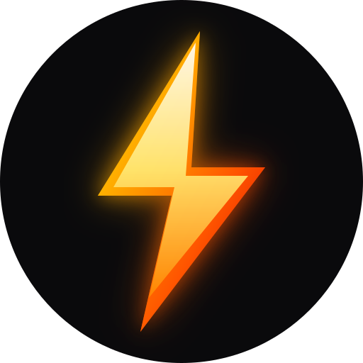

# KAIOKEN — Design System Reference

> **Purpose:** A complete, deep design specification extracted from the Kaioken website (d:\project\ai_now_know\website). Use this document as the single source of truth when building a new Kaioken-branded website in a separate location.

---

## Table of Contents

1. [Design Philosophy](#1-design-philosophy)
2. [File Structure](#2-file-structure)
3. [Images and Assets](#3-images-and-assets)
4. [Fonts and Typography Scale](#4-fonts-and-typography-scale)
5. [Color Palette Raw](#5-color-palette-raw)
6. [Semantic Tokens Dark Mode Default](#6-semantic-tokens-dark-mode-default)
7. [Semantic Tokens Light Mode](#7-semantic-tokens-light-mode)
8. [Spacing System](#8-spacing-system)
9. [Shape and Border Radius](#9-shape-and-border-radius)
10. [Motion System](#10-motion-system)
11. [Layout Primitives](#11-layout-primitives)
12. [Typography Utilities](#12-typography-utilities)
13. [Buttons](#13-buttons)
14. [Visual Effects](#14-visual-effects)
15. [Animations and Keyframes](#15-animations-and-keyframes)
16. [Component Patterns](#16-component-patterns)
17. [Page Structure and Routes](#17-page-structure-and-routes)
18. [Theme Toggle](#18-theme-toggle)
19. [CSS File Location](#19-css-file-location)

---

## 1. Design Philosophy

Kaioken's visual design follows a strict **technical precision** aesthetic:

- **Dark-first**: Deep near-black ink backgrounds with precise ink-step hierarchy.
- **Hairline grid system**: Every border is exactly 1px (--hair). Sections separated by hairline rules.
- **Monochromatic with a single accent**: Everything is desaturated ink/paper, with vivid **red accent** (#ff3b1f dark / #b81600 light) and secondary **ember orange** (#ff9500).
- **Terminal aesthetic**: Primary typeface for UI chrome is Geist Mono.
- **Serif italic accent**: Instrument Serif italic used only for emotional emphasis in headlines. Always in brand accent red.
- **No glows in production**: All decorative light bloom effects explicitly disabled (display: none !important).
- **Zero border-radius on controls**: Buttons and section containers are fully sharp (order-radius: 0). Only 2px on small pill elements.
- **Scroll-reveal entrance**: All sections use IntersectionObserver to add .reveal-in / .stagger-in classes.

---

## 2. File Structure

`
d:\project\ai_now_know\website\
├── src\
│   ├── index.css               <- MASTER STYLESHEET (all design tokens + components)
│   ├── App.tsx                 <- Router + layout shell
│   ├── assets\
│   │   ├── kaioken-logo.png    <- Pixel-art logo (primary)
│   │   ├── kaio_pet.png        <- Mascot character
│   │   ├── home-bg.jpg         <- Hero background wallpaper
│   │   ├── desktop-bg.jpg      <- Desktop page background
│   │   └── kaiokenLogoDataUri.ts
│   ├── components\             <- 49 UI components
│   └── pages\                  <- 6 page routes + docs + preview
├── public\
│   ├── kaioken-logo.png
│   ├── kaio_pet.png
│   ├── home-bg.jpg
│   ├── desktop-bg.jpg
│   ├── favicon.svg
│   ├── logo.svg
│   ├── prism-logo.svg
│   └── assets\
│       ├── hero-engraving.jpg / *-600w.webp / *-1200w.webp
│       ├── feature-delegate.jpg / *-600w.webp / *-1200w.webp
│       ├── feature-ingest.jpg  / *-600w.webp / *-1200w.webp
│       ├── feature-multiplier.jpg / *-600w.webp / *-1200w.webp
│       ├── feature-remember.jpg / *-600w.webp / *-1200w.webp
│       ├── feature-research.jpg / *-600w.webp / *-1200w.webp
│       ├── feature-verify.jpg  / *-600w.webp / *-1200w.webp
│       ├── platform-linux.jpg  / *-600w.webp / *-1200w.webp
│       ├── platform-mac.jpg    / *-600w.webp / *-1200w.webp
│       ├── platform-win.jpg    / *-600w.webp / *-1200w.webp
│       ├── kaio_cercle_logo.png
│       ├── kaioken-logo.png
│       └── favicon-64.png
└── design\                     <- EXPORTED DESIGN SYSTEM (this folder)
    ├── kaioken-design-system.css
    └── design.md
`

---

## 3. Images and Assets

All images are shown below with their exact absolute paths on your PC. Copy these paths when referencing assets in a new project.

---

### Logos and Identity

#### `kaioken-logo.png` — Brand Logo (Pixel Art)

> **Path:** `d:\project\ai_now_know\website\public\kaioken-logo.png`  
> **Usage:** Header + Footer. Always render with `image-rendering: pixelated` (class `.k-pixel-logo`).

---

#### `favicon.svg` — Browser Favicon

> **Path:** `d:\project\ai_now_know\website\public\favicon.svg`

---

#### `logo.svg` — SVG Logo Variant

> **Path:** `d:\project\ai_now_know\website\public\logo.svg`

---

#### `prism-logo.svg` — Prism Partner Logo

> **Path:** `d:\project\ai_now_know\website\public\prism-logo.svg`

---

### Mascot

#### `kaio_pet.png` — Kaio Pet Mascot

> **Path:** `d:\project\ai_now_know\website\public\kaio_pet.png`  
> **Usage:** Hero right column. Render with `image-rendering: pixelated`.

---

#### `kaio_cercle_logo.png` — Circle-Cropped Logo Variant

> **Path:** `d:\project\ai_now_know\website\public\assets\kaio_cercle_logo.png`

---

### Backgrounds and Wallpapers

#### `home-bg.jpg` — Hero Section Wallpaper

> **Path (public):** `d:\project\ai_now_know\website\public\home-bg.jpg` (~1MB)  
> **Path (bundled):** `d:\project\ai_now_know\website\src\assets\home-bg.jpg`  
> **Usage:** Fixed background behind the Hero section. Apply `filter: blur()` and `opacity` for the dark wallpaper effect.

---

#### `desktop-bg.jpg` — Desktop Page Background

> **Path (public):** `d:\project\ai_now_know\website\public\desktop-bg.jpg` (~3.1MB)  
> **Path (bundled):** `d:\project\ai_now_know\website\src\assets\desktop-bg.jpg`

---

### Feature Images

All feature images live in `d:\project\ai_now_know\website\public\assets\`.  
Each ships in 3 formats: `.jpg` (original), `-600w.webp` (small), `-1200w.webp` (large).

#### `hero-engraving.jpg`

> **Path:** `d:\project\ai_now_know\website\public\assets\hero-engraving.jpg`

---

#### `feature-delegate.jpg`

> **Path:** `d:\project\ai_now_know\website\public\assets\feature-delegate.jpg`  
> **600w:** `d:\project\ai_now_know\website\public\assets\feature-delegate-600w.webp`  
> **1200w:** `d:\project\ai_now_know\website\public\assets\feature-delegate-1200w.webp`

---

#### `feature-ingest.jpg`

> **Path:** `d:\project\ai_now_know\website\public\assets\feature-ingest.jpg`  
> **600w:** `d:\project\ai_now_know\website\public\assets\feature-ingest-600w.webp`

---

#### `feature-multiplier.jpg`

> **Path:** `d:\project\ai_now_know\website\public\assets\feature-multiplier.jpg`  
> **600w:** `d:\project\ai_now_know\website\public\assets\feature-multiplier-600w.webp`

---

#### `feature-remember.jpg`

> **Path:** `d:\project\ai_now_know\website\public\assets\feature-remember.jpg`  
> **600w:** `d:\project\ai_now_know\website\public\assets\feature-remember-600w.webp`

---

#### `feature-research.jpg`

> **Path:** `d:\project\ai_now_know\website\public\assets\feature-research.jpg`  
> **600w:** `d:\project\ai_now_know\website\public\assets\feature-research-600w.webp`

---

#### `feature-verify.jpg`

> **Path:** `d:\project\ai_now_know\website\public\assets\feature-verify.jpg`  
> **600w:** `d:\project\ai_now_know\website\public\assets\feature-verify-600w.webp`

---

### Platform Images

#### `platform-linux.jpg`

> **Path:** `d:\project\ai_now_know\website\public\assets\platform-linux.jpg`  
> **600w:** `d:\project\ai_now_know\website\public\assets\platform-linux-600w.webp`

---

#### `platform-mac.jpg`

> **Path:** `d:\project\ai_now_know\website\public\assets\platform-mac.jpg`  
> **600w:** `d:\project\ai_now_know\website\public\assets\platform-mac-600w.webp`

---

#### `platform-win.jpg`

> **Path:** `d:\project\ai_now_know\website\public\assets\platform-win.jpg`  
> **600w:** `d:\project\ai_now_know\website\public\assets\platform-win-600w.webp`

---

### App Screenshots

#### `graph.png`

> **Path:** `d:\project\ai_now_know\website\public\shots\graph.png`

---

#### `wiki_doc.png`

> **Path:** `d:\project\ai_now_know\website\public\shots\wiki_doc.png`

---

#### `wiki_index.png`

> **Path:** `d:\project\ai_now_know\website\public\shots\wiki_index.png`

---

### Desktop App Logo

#### `desktop-app-logo.png`

> **Path:** `d:\project\ai_now_know\website\public\desktop-app-logo.png`

| Platform Linux | platform-linux.jpg | platform-linux-600w.webp | platform-linux-1200w.webp |
| Platform Mac | platform-mac.jpg | platform-mac-600w.webp | platform-mac-1200w.webp |
| Platform Windows | platform-win.jpg | platform-win-600w.webp | platform-win-1200w.webp |

### App Screenshots (in d:\project\ai_now_know\website\public\shots\)

| File | Absolute Path |
|------|---------------|
| graph.png | d:\project\ai_now_know\website\public\shots\graph.png |
| wiki_doc.png | d:\project\ai_now_know\website\public\shots\wiki_doc.png |
| wiki_index.png | d:\project\ai_now_know\website\public\shots\wiki_index.png |

---

## 4. Fonts and Typography Scale

### Font Families

`css
@import url('https://fonts.googleapis.com/css2?family=Geist+Mono:wght@400;500;600;700&family=Geist:wght@400;500;600;700&family=Instrument+Serif:ital@1&display=swap');

--font-sans:  'Geist', system-ui, -apple-system, BlinkMacSystemFont, sans-serif;
--font-mono:  'Geist Mono', ui-monospace, 'SF Mono', Menlo, monospace;
--font-serif: 'Instrument Serif', Georgia, serif;
`

Usage rules:
- --font-sans -> Body copy, headings, leads
- --font-mono -> All navigation, labels, badges, code, buttons, terminal content
- --font-serif -> Italic emotional emphasis only, always in --accent red

### Type Scale

| Token | Value | Usage |
|-------|-------|-------|
| --fs-micro | 10px | Taglines, status indicators, version badges |
| --fs-label | 11px | Uppercase monospace labels, section eyebrows |
| --fs-xs | 12px | Small secondary text, copy buttons |
| --fs-sm | 13px | Description text in components, table rows |
| --fs-base | 14px | Base body font size (set on html element) |
| --fs-md | 15px | Lead paragraphs |
| --fs-lg | 17px | Stat values, emphasis numbers |
| --fs-xl | 20px | Reserved for accented values |
| --fs-h3 | clamp(17px, 15px + .4vw, 20px) | H3 headings (fluid) |
| --fs-h2 | clamp(24px, 18px + 1.7vw, 40px) | H2 headings (fluid) |
| --fs-h1 | clamp(38px, 24px + 4.2vw, 72px) | H1 hero headline (fluid) |

### Letter-Spacing

| Token | Value | Usage |
|-------|-------|-------|
| --track-h1 | -.045em | H1 tight tracking |
| --track-h2 | -.038em | H2 tracking |
| --track-h3 | -.022em | H3 tracking |
| --track-label | .12em | Label spacing (expanded mono) |

### Line Heights

| Token | Value |
|-------|-------|
| --lh-h1 | .98 |
| --lh-h2 | 1.05 |
| --lh-body | 1.62 |

---

## 5. Color Palette Raw

### Ink Scale (Dark backgrounds and text)

| Token | Hex | Usage |
|-------|-----|-------|
| --ink-1000 | #08080a | Deepest bg-sunk (darkest possible) |
| --ink-950 | #0a0a0b | Primary dark background |
| --ink-900 | #101012 | Raised surface |
| --ink-850 | #16161a | Raised-2 surface |
| --ink-800 | #1c1c21 | Reserved |
| --ink-700 | #232327 | Default rule/border |
| --ink-600 | #33333a | Strong rule |
| --ink-400 | #70707a | Muted foreground |
| --ink-300 | #a8a8b0 | Secondary foreground |
| --ink-100 | #e6e6e9 | Reserved |
| --ink-50 | #f5f5f6 | Primary foreground (text on dark) |

### Paper Scale (Light mode)

| Token | Hex | Usage |
|-------|-----|-------|
| --paper-50 | #ffffff | Raised surface in light |
| --paper-100 | #fafaf9 | Primary background in light |
| --paper-200 | #f0efed | Sunk background in light |
| --paper-300 | #e3e2de | Default border in light |
| --paper-400 | #c9c7c1 | Strong border in light |
| --paper-600 | #6b6b73 | Muted text in light |
| --paper-800 | #33333a | Secondary text in light |
| --paper-950 | #141416 | Primary text in light |

### Brand Accent — Kaioken Red

| Token | Hex | Usage |
|-------|-----|-------|
| --red-bright | #ff3b1f | Dark mode primary accent |
| --red-mid | #ff1e00 | Dark mode hover |
| --red-deep | #c01500 | Light mode hover |
| --red-ink | #b81600 | Light mode primary accent |

### Secondary Accent — Ember Orange

| Token | Hex | Usage |
|-------|-----|-------|
| --ember-bright | #ff9500 | Dark mode ember (success/output) |
| --ember-mid | #e07f00 | Reserved |
| --ember-ink | #9a5600 | Light mode ember |

---

## 6. Semantic Tokens Dark Mode Default

### Backgrounds

| Token | Dark Resolves To | Light Resolves To |
|-------|-----------------|-------------------|
| --bg | --ink-950 (#0a0a0b) | --paper-100 (#fafaf9) |
| --bg-sunk | --ink-1000 (#08080a) | --paper-200 (#f0efed) |
| --bg-raise | --ink-900 (#101012) | --paper-50 (#fff) |
| --bg-raise-2 | --ink-850 (#16161a) | --paper-50 (#fff) |

### Foreground Text

| Token | Dark | Light |
|-------|------|-------|
| --fg | --ink-50 (#f5f5f6) | --paper-950 (#141416) |
| --fg-2 | --ink-300 (#a8a8b0) | --paper-800 (#33333a) |
| --fg-mute | --ink-400 (#70707a) | --paper-600 (#6b6b73) |

### Borders and Rules

| Token | Dark | Light |
|-------|------|-------|
| --rule | --ink-700 (#232327) | --paper-300 (#e3e2de) |
| --rule-strong | --ink-600 (#33333a) | --paper-400 (#c9c7c1) |

### Accent and Brand

| Token | Dark | Light | Description |
|-------|------|-------|-------------|
| --accent | #ff3b1f | #b81600 | Primary brand action color |
| --accent-hov | #ff1e00 | #c01500 | Accent hover state |
| --accent-fg | #ffffff | --paper-50 | Text on accent background |
| --accent-soft | 
gba(255,59,31,0.09) | 
gba(184,22,0,0.07) | Soft tinted active nav bg |
| --accent-line | 
gba(255,59,31,0.24) | 
gba(184,22,0,0.22) | Accent border variant |
| --ember | #ff9500 | #9a5600 | Secondary/success indicator |
| --ember-soft | 
gba(255,149,0,0.08) | 
gba(154,86,0,0.07) | Soft ember tint |
| --select | 
gba(255,59,31,0.22) | 
gba(184,22,0,0.15) | Text selection highlight |

### Surface Layers (Glassmorphism)

| Token | Dark Value | Light Value |
|-------|-----------|-------------|
| --surface-base | 
gba(14,14,18,0.72) | 
gba(255,255,255,0.7) |
| --surface-1 | 
gba(20,20,25,0.82) | 
gba(255,255,255,0.85) |
| --surface-2 | 
gba(28,28,34,0.9) | 
gba(245,245,243,0.95) |

### Kai-Prefixed Aliases

| Token | Resolves To | Fixed Hex |
|-------|-------------|-----------|
| --kai-red | --accent | — |
| --kai-orange | --accent | — |
| --kai-amber | --ember | — |
| --kai-tan | — | #d7af87 |
| --kai-blue | — | #87d7ff |
| --kai-green | — | #10b981 |
| --kai-sage | — | #87af87 |
| --kai-rose | --accent | — |
| --kai-panel | --bg-raise | — |
| --kai-dim | --fg-mute | — |

---

## 7. Semantic Tokens Light Mode

Apply by setting <html data-theme="light">.

All semantic tokens automatically remap to paper-scale values. See the comparison table in Section 6 above.

---

## 8. Spacing System

4px base unit grid:

| Token | Value |
|-------|-------|
| --s-1 | 4px |
| --s-2 | 8px |
| --s-3 | 12px |
| --s-4 | 16px |
| --s-5 | 24px |
| --s-6 | 32px |
| --s-7 | 48px |
| --s-8 | 64px |
| --s-9 | 96px |

---

## 9. Shape and Border Radius

| Token | Value | Usage |
|-------|-------|-------|
| --r-none | px | Buttons, major containers |
| --r-sm | 2px | Nav links, toggle buttons, small items |
| --r-md | 3px | Cards (rarely used) |
| --r-full | 999px | Status dots, pill shapes |
| --hair | 1px | Universal border width |

---

## 10. Motion System

| Token | Value | Usage |
|-------|-------|-------|
| --dur-fast | .14s | Micro-interactions (tab hover) |
| --dur-ui | .2s | Standard UI transitions |
| --ease | cubic-bezier(.22, 1, .36, 1) | Signature easing: fast start, slow settle |

---

## 11. Layout Primitives

| Token | Value |
|-------|-------|
| --page-max | 1200px |
| --prose-max | 62ch |
| --gutter | clamp(20px, 4vw, 48px) |
| --section-y | clamp(56px, 7vw, 104px) |
| --control-h | 38px |

CSS Classes:
- .section — section with vertical padding + hairline top border
- .wrap — centered container, max 1200px, fluid padding
- .prose — max 62ch width for text
- .grid-rule — grid with 1px rule-colored gaps between cells

---

## 12. Typography Utilities

| Class | Usage |
|-------|-------|
| .h1 | H1 display headline, fluid size |
| .h2 | H2 section heading, fluid size |
| .h3 | H3 sub-heading, fluid size |
| .serif | Italic Instrument Serif, always in --accent red |
| .lead | Larger secondary body text (--fg-2, 15px) |
| .mono | Inline monospace |
| .label | Uppercase monospace micro-label (11px, +0.12em) |
| .label--accent | Label in accent red |
| .head | Section head block: [index] [title] [note] |
| .head-num | Accent monospace index in head block |
| .head-title | H3-sized title in head block |
| .head-note | Muted xs monospace note in head block |
| .caption | Centered label between two hairlines |
| .caption--left | Left-aligned caption (no left rule) |
| .caption-text | The text inside a caption |
| .k-pixel-logo | Pixelated image rendering for pixel-art logo |

---

## 13. Buttons

| Class | Height | Padding | Font size | Style |
|-------|--------|---------|-----------|-------|
| .btn | 38px | 16px | 13px mono | Ghost, border |
| .btn.btn--primary | 38px | 16px | 13px mono bold | Filled accent |
| .btn.btn--sm | 30px | 12px | 12px mono | Small ghost |
| .btn.btn--lg | 46px | 24px | 14.5px mono | Large ghost |
| .btn.btn--primary.btn--sm | 30px | 12px | Small primary |

Button properties: zero border-radius, Geist Mono font, transitions on background/border/color.

---

## 14. Visual Effects

| Class | Effect |
|-------|--------|
| .tech-grid-bg | 36px hairline technical grid overlay |
| .glass | Glassmorphism: blur(20px) + border + inset shadows |
| .lift | Card hover: translateY(-2px) + depth shadow |
| .panel-glow | Standard panel drop shadow |
| .panel-glow-strong | Stronger panel shadow |
| .btn-glow | Button shadow depth |
| .bg | Film grain + radial vignette via ::before / ::after |
| .kai-bloom | DISABLED (display: none) |
| .glow-orange | DISABLED (text-shadow: none) |
| .glow-amber | DISABLED (text-shadow: none) |

---

## 15. Animations and Keyframes

| Class | Animation | Duration | Description |
|-------|-----------|----------|-------------|
| .animate-caret | caret-blink | 1.05s step-end | Blinking terminal cursor |
| .animate-rise | 
ise-in | .55s | Rise from below entrance |
| .rule-sweep | 
ule-sweep | 6s linear | Sweeping accent horizontal rule |
| .animate-bloom | loom-drift | 26s | Slow decorative background drift |
| .animate-float | loat | 5s | Float up/down (mascot, hero elements) |
| .animate-shimmer | shimmer | 2.4s | Skeleton loader sweep |
| .animate-tour | 	our-fill | JS-controlled | Progress bar fill |
| .reveal | — | .6s | Scroll-reveal start state |
| .reveal-in | — | — | Scroll-reveal visible state |
| .stagger-in | — | .5s | Staggered children start state |

Scroll reveal pattern: use IntersectionObserver to add .reveal-in class when element enters viewport.

---

## 16. Component Patterns

### 16.1 Navigation Header

Classes: .hdr, .hdr.is-scrolled, .hdr-in.wrap, .brand, .brand-logo-img, .brand-ver.mono, .nav, .nav-a, .nav-a.is-active, .nav-a--ext, .hdr-right, .tgl

- Fixed, z-index 1000, height 56px
- Background blur(16px), 90% opacity, stronger on scroll
- Nav hidden below 900px

### 16.2 Hero Section

Classes: .hero.bg, .hero-content-wrapper.wrap, .hero-footer-bar, .hero-top, .hero-eyebrow, .hero-h1, .hero-sub, .hero-act, .hero-repo, .hero-stats, .stat, .stat-v

- Full viewport height (100dvh)
- 12-column grid: 8 cols content + 4 cols mascot
- Sticky bottom status bar
- Stats strip: 4-column grid with hairline gaps

### 16.3 Terminal Component

Classes: .term, .term-bar, .term-status, .term-body, .tl, .tl-gap, .tl-bad, .t-pr, .t-cmd, .t-m, .t-m-done, .t-m-bad, .t-k, .t-k-done, .t-k-bad, .t-v, .t-n, .t-note, .t-accent

Color semantics: red = error, ember = success/running

### 16.4 Comparison Panels

Classes: .cmp, .pnl, .pnl-h, .pnl-dot.pnl-dot--bad, .pnl-dot.pnl-dot--good, .pnl-l, .pnl-s, .claims, .claim.claim--bad, .claim.claim--good, .claim.claim--plain, .claim-t, .claim-n.claim-n--bad, .claim-n.claim-n--good

2-column hairline grid that collapses to 1 column below 820px.

### 16.5 Pipeline Stages

Classes: .pipe, .stage, .stage-h, .stage-n, .stage-rule, .stage-t, .stage-d, .stage-o

4-column hairline grid, collapses to 2 at 900px, 1 at 520px.

### 16.6 Capability Cards

Classes: .caps, .cap, .cap-i, .cap-t, .cap-d

Used inside .grid-rule. 3 columns, collapses 2 at 900px, 1 at 560px.

### 16.7 Data Table

Classes: .tw, .tbl, .c-lv, .c-nm, .c-mut, .c-tp

Scrollable wrapper (.tw) around a full-width table. Min-width 640px.

### 16.8 Install and Code Block

Classes: .ins, .ins-bar, .tabs, .tab, .tab.on, .pane, .lines, .line, .line.cm, .cp, .cp.done, .plats, .plat, .plat-t, .plat-os, .plat-m, .plat-f, .plat-b, .ins-foot

Tabbed code block with copy button. Platform cards in a 3-column grid.

### 16.9 Footer

Classes: .ftr, .ftr-hero, .ftr-hero-left, .ftr-hero-h, .ftr-hero-sub, .ftr-hero-act, .ftr-btn-lg, .ftr-grid, .ftr-brand, .ftr-logo-img, .fb-tagline, .fb-say, .fb-badges, .fb-badge, .ftr-col, .ftr-h, .ftr-ul, .ftr-a, .ftr-ext, .ftr-end, .ftr-end-left, .ftr-end-right, .ftr-dot, .ftr-status, .status-dot

4-column footer grid. Collapses to 2 at 960px, 1 at 540px.

---

## 17. Page Structure and Routes

| Route | Component | Description |
|-------|-----------|-------------|
| / | Home.tsx | Landing page (own Header/Footer, full-height hero) |
| /desktop | Desktop.tsx | Desktop app showcase |
| /desktop-bg-preview | DesktopBgPreview.tsx | Background preview |
| /showcase | Showcase.tsx | Output showcase gallery |
| /next | Next.tsx | What is next page |
| /roadmap | RoadmapPage.tsx | Full roadmap |
| /docs | DocsLayout.tsx | Documentation with sidebar |
| /docs/install | Install.tsx | Installation guide |
| /docs/tui | Tui.tsx | TUI reference |
| /docs/commands | CommandsDoc.tsx | Commands reference |
| /docs/agent | Agent.tsx | Agent guide |
| /docs/research | Research.tsx | Research guide |
| /docs/wiki | Wiki.tsx | Wiki reference |
| /preview | PreviewLayout.tsx | Output preview (lazy loaded) |

### Home Page Section Order
1. HomeBackground (fixed bg wallpaper)
2. Header (fixed nav)
3. Hero (full viewport height)
4. WhyBuilt (section 01 — motivation comparison)
5. Pillars (section 02 — three architectural pillars)
6. BuiltBy (section 03 — team info)
7. Install (section 04 — quick install)
8. Footer (closing CTA + links)

---

## 18. Theme Toggle

Theme stored in localStorage as kaioken-theme. Applied via data-theme on <html>.

`html
<!-- Add to <head> for flash prevention -->

`

`js
// Toggle function
function toggleTheme() {
  const current = document.documentElement.dataset.theme || 'dark';
  const next = current === 'dark' ? 'light' : 'dark';
  document.documentElement.dataset.theme = next;
  localStorage.setItem('kaioken-theme', next);
}
`

---

## 19. CSS File Location

The standalone extracted design system CSS (no Tailwind, no framework):

`
d:\project\ai_now_know\website\design\kaioken-design-system.css
`

To use in a new vanilla HTML project:

`html
<!DOCTYPE html>
<html lang="en" data-theme="dark">
<head>
  <meta charset="UTF-8" />
  <meta name="viewport" content="width=device-width, initial-scale=1.0" />
  <title>Kaioken Site</title>
  <link rel="stylesheet" href="./kaioken-design-system.css" />
  
</head>
<body>
  <header class="hdr">
    

      <a href="/" class="brand">
        
        v2.0.0
      </a>
      <nav class="nav">
        <a href="/" class="nav-a is-active">Home</a>
        <a href="/docs" class="nav-a">Docs</a>
      </nav>
      

        <a href="#install" class="btn btn--primary btn--sm">Get started</a>
      

    

  </header>

  <main>
    <section class="hero bg">
      

        

          
YOUR PRODUCT LABEL

          <h1 class="h1 hero-h1">Your headline with emphasis.</h1>
          
Lead paragraph here.

          

            <a href="#" class="btn btn--primary">Primary Action</a>
            <a href="#" class="btn">Secondary</a>
          

        

      

      

        

          STATUS MESSAGE HERE
          <a href="#next">Scroll down</a>
        

      

    </section>

    <section id="why" class="section">
      

        

          01
          Section Title
          optional note
        

        <!-- content here -->
      

    </section>
  </main>

  <footer class="ftr">
    

      

        

          2025 Your Name
        

        

          <i class="status-dot"></i>All systems nominal
        

      

    

  </footer>

  
</body>
</html>
`

> **Note:** The original site uses Tailwind CSS 4 alongside the custom CSS. The exported kaioken-design-system.css removes that dependency. It is pure vanilla CSS ready to use standalone without any build tool.